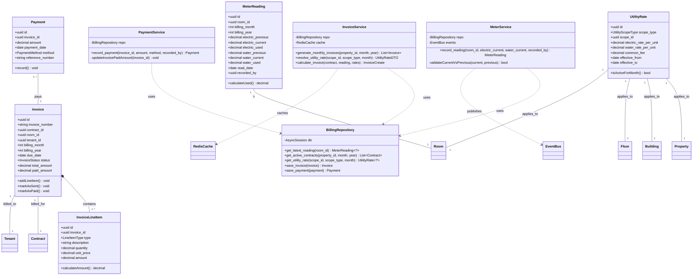
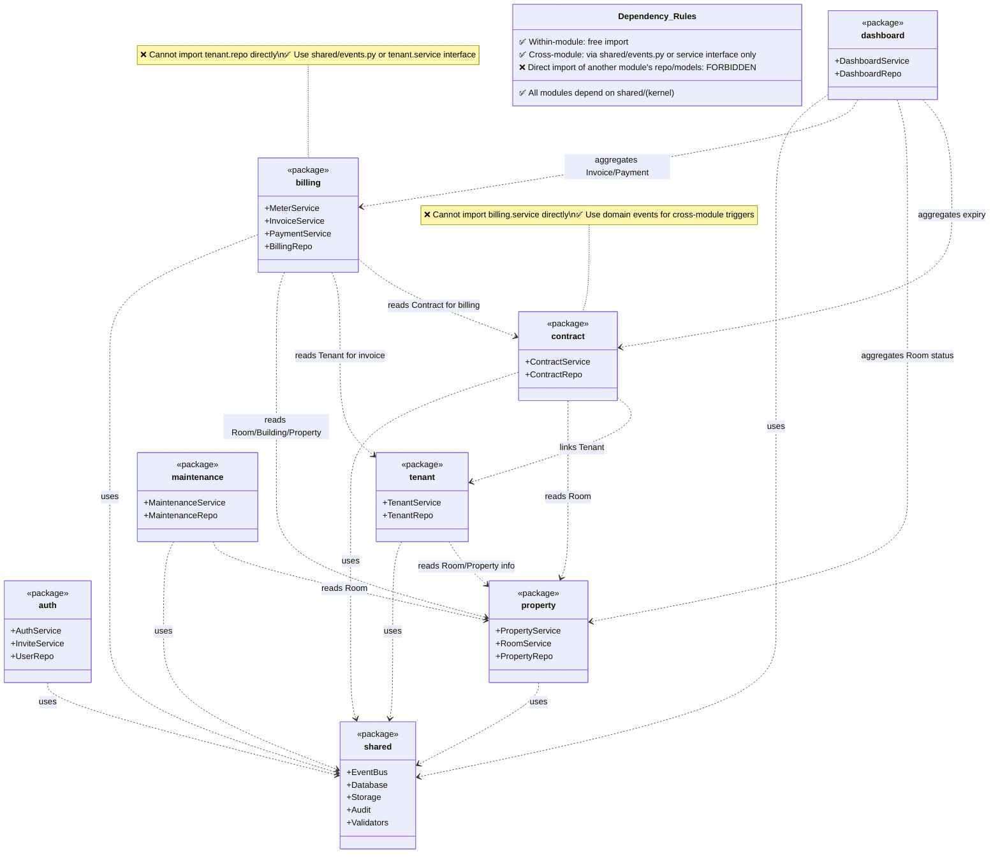

# File: 02-design/SDD/01-architecture.md
# UML Design Diagrams + Architecture Rules
## Property Management System

ส่วนนี้อ้างอิงสถาปัตยกรรมรวมใน `docs/ARCHITECTURE.md` และระบุรายละเอียด UML สำหรับระบบ รวมถึงกฎ Dependency ระหว่างโมดูล

---

## 10.1 UML Class Diagram — Billing Module



**คำอธิบายสัญลักษณ์:**
- `+` = public, `-` = private, `#` = protected
- `--` = Association, `*--` = Composition, `..>` = Dependency
- `1`, `1..*`, `0..1` = Multiplicity
- Subgraph = Layer boundary (Domain/Application/Infrastructure)

---

## 10.2 UML Package/Component Diagram — Module Dependencies



---

## 10.5 UML Activity Diagram — Cascade Rate Resolution Algorithm

```mermaid
flowchart TD
    Start([Start: resolve_utility_rate]) --> Input[Input: scope_id, scope_type, billing_month]
    Input --> QueryDB[Query utility_rates table]
    QueryDB --> CheckFound{Rate found?}
    
    CheckFound -- Yes --> ReturnRate[Return resolved rates]
    
    CheckFound -- No --> CheckScope{scope_type == 'property'?}
    
    CheckScope -- Yes --> Error[❌ Error: Property must have rate]
    
    CheckScope -- No --> GetParent[Get parent scope:\\nRoom→Floor→Building→Property]
    GetParent --> Recurse[Recursive call:\\nresolve_utility_rate(parent_id, parent_type, month)]
    Recurse --> QueryDB
    
    ReturnRate --> CacheL1[Cache in L1: request-scoped lru_cache]
    CacheL1 --> CacheL2[Cache in L2: Redis 24h TTL]
    CacheL2 --> End([End: return UtilityRateDTO])
    
    Error --> End
```

> **หมายเหตุ:** ไดอะแกรมทั้งหมดเขียนใน **Mermaid syntax** เพื่อให้:
> - ✅ แสดงใน GitHub/GitLab Markdown ได้ทันที
> - ✅ เวอร์ชันคอนโทรลได้ (เก็บเป็น text ใน git)
> - ✅ แก้ไขง่ายกว่าภาพวาด (Visio/Draw.io)
> - ✅ AI Agent อ่านและสร้างโค้ดจากโครงสร้างได้

---

## Layer Responsibility & Cross-Module Rules

### ✅ Layer Responsibility
- `routers/` ไม่มี business logic — เรียกเฉพาะ `service.method()`
- `services/` ไม่เรียก `db.execute()` โดยตรง — ใช้ `repository.method()` เท่านั้น
- `repository.py` มีเฉพาะ database queries — ไม่มี business rule
- `models.py` มีเฉพาะ SQLAlchemy definitions — ไม่มี method ที่มี logic

### ✅ Cross-Module Rules
- ไม่มีการ `from app.modules.X import ...` ใน `app/modules/Y`
- การสื่อสารข้ามโมดูลใช้ `shared/events.py` หรือ service interface เท่านั้น
- Dependency graph เป็น DAG (ไม่มี circular import) — ตรวจสอบด้วย `pydeps`

### ✅ Security & Audit
- ทุก endpoint ที่ไม่ใช่ `/auth/*` มี `Authorization: Bearer *** dependency
- ID card ถูก encrypt ด้วย `encrypt_sensitive()` ก่อนเก็บลง DB
- ทุก sensitive operation เรียก `audit.log_audit()`
- Password hash ใช้ `Argon2id` (OWASP 2026, RFC 9106)