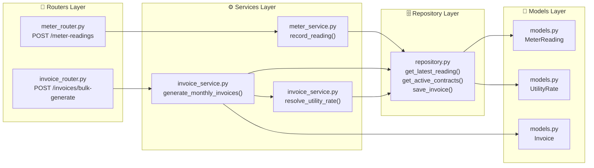
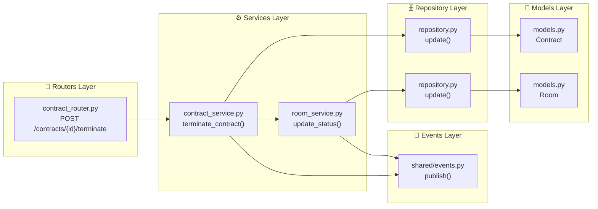
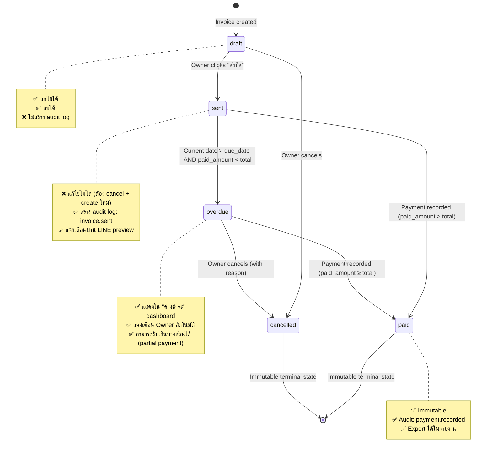

# File: 02-design/SDD/02-module-specs.md
# Module Specifications + File Structure + Contracts + Flow Diagrams
## Property Management System

---

## 2. Module Specifications

### 2.1 Auth Module (`app/modules/auth/`)

#### Files to Create
```text
app/modules/auth/
├── __init__.py           # Public API exports
├── models.py             # User SQLAlchemy model
├── schemas.py            # Pydantic: AuthRequest, TokenResponse, InviteRequest
├── repository.py         # User CRUD operations
├── services/
│   ├── auth_service.py   # Login, token generation, password validation
│   └── invite_service.py # Internal invite link generation
├── routers/
│   └── auth_router.py    # POST /login, POST /register, POST /invite, GET /me
├── events.py             # Domain events: user.registered, user.invited
└── constants.py          # Token expiry constants
```

#### Key Functions & Contracts

| Function | Input | Output | Dependencies | FR/BR |
|----------|-------|--------|-------------|-------|
| `AuthService.login(email, password)` | `str, str` | `User + tokens` | `UserRepo.get_by_email()`, `passlib.argon2()` | FR-USER-01 |
| `AuthService.generate_tokens(user_id, property_scopes)` | `uuid, list[uuid]` | `access_token, refresh_token` | `python-jose`, `settings.SECRET_KEY` | FR-USER-01 |
| `InviteService.create_invite(email, property_id, inviter_id)` | `str, uuid, uuid` | `invite_link: str` | `settings.APP_DOMAIN`, `jwt.encode()` | FR-USER-02 |
| `InviteService.accept_invite(token, password)` | `str, str` | `User` | `jwt.decode()`, `UserRepo.create()`, `audit.log_audit()` | FR-USER-02 |

#### Validation Rules
```python
# schemas.py
class AuthRequest(BaseModel):
    email: EmailStr = Field(..., max_length=255)
    password: str = Field(..., min_length=8, pattern=r"^(?=.*[a-z])(?=.*[A-Z])(?=.*\d)")
    
    @field_validator("password")
    @classmethod
    def validate_password_strength(cls, v: str) -> str:
        if len(v) < 8 or not re.search(r"[A-Z]", v) or not re.search(r"\d", v):
            raise ValueError("Password must contain uppercase, lowercase, and number")
        return v
```

#### Error Handling
| Scenario | Error Code | HTTP Status | Message |
|----------|-----------|-------------|---------|
| Invalid credentials | AUTH-001 | 401 | "Invalid email or password" |
| Account inactive | AUTH-002 | 403 | "Account is not active" |
| Invite token expired | AUTH-003 | 401 | "Invite link has expired" |
| Email already registered | AUTH-004 | 409 | "Email already in use" |

#### Example: `auth_router.py`
```python
@router.post("/login", response_model=TokenResponse)
async def login(payload: AuthRequest, db: AsyncSession = Depends(get_db)):
    service = AuthService(db)
    user, tokens = await service.authenticate(payload.email, payload.password)
    await audit.log_audit(db, user.id, "user.logged_in", "user", user.id, user.property_scopes[0])
    return TokenResponse(access_token=tokens["access"], refresh_token=tokens["refresh"], user=user)
```

---

### 2.2 Property Module (`app/modules/property/`)

#### Files to Create
```text
app/modules/property/
├── __init__.py
├── models.py             # Property, Building, Floor, Room
├── schemas.py            # PropertyCreate, PropertyListResponse, BuildingCreate, FloorCreate, RoomCreate, RoomResponse
├── repository.py         # Property structure queries
├── services/
│   ├── property_service.py   # CRUD for Property/Building/Floor
│   └── room_service.py       # CRUD for Room, status management
├── routers/
│   ├── property_router.py    # CRUD for Property, Building, Floor
│   └── room_router.py        # CRUD for Room, GET /rooms?building_id=X
├── events.py             # room.created, room.status_changed
└── constants.py          # RoomStatus, RoomType enums
```

#### Key Functions & Contracts

| Function | Input | Output | Dependencies | FR/BR |
|----------|-------|--------|-------------|-------|
| `PropertyService.create_property(name, address, billing_due_day, created_by)` | `str, str, int, uuid` | `Property` | `PropertyRepo.create()`, `audit.log_audit()` | FR-PROP-01 |
| `PropertyService.list_properties()` | — | `List[Property]` | `PropertyRepo.get_all()` | FR-PROP-01 |
| `PropertyService.get_property_by_id(property_id)` | `uuid` | `Property` | `PropertyRepo.get_by_id()` | FR-PROP-02 |
| `RoomService.create_room(property_id, building_id, floor_id, room_number, base_rent, room_type)` | `uuid, uuid, uuid?, str, decimal, str` | `Room` | `RoomRepo.create()`, `BR-11, BR-12` validation | FR-PROP-05, BR-11, BR-12 |
| `RoomService.update_status(room_id, new_status)` | `uuid, RoomStatus` | `Room` | `RoomRepo.update()`, `events.publish("room.status_changed")` | FR-PROP-05 |

#### Validation Rules
```python
# services/room_service.py
async def create_room(self, property_id: UUID, building_id: UUID, floor_id: Optional[UUID], room_number: str, base_rent: Decimal, room_type: RoomType) -> Room:
    if floor_id is None:
        has_floors = await self.repo.building_has_floors(building_id)
        if has_floors:
            raise ValueError("Floor is required for buildings with floors")
    if await self.repo.room_number_exists(building_id, room_number):
        raise ValueError(f"Room number {room_number} already exists in this building")
    return await self.repo.create(...)
```

#### Error Handling
| Scenario | Error Code | HTTP Status | Message |
|----------|-----------|-------------|---------|
| Duplicate room number | PROP-001 | 409 | "Room number already exists in this building" |
| Invalid floor reference | PROP-002 | 400 | "Floor does not belong to this building" |
| Cannot delete occupied room | PROP-003 | 409 | "Cannot delete room with active tenant" |
| Property not found | PROP-004 | 404 | "Property not found" |

---

### 2.3 Billing Module (`app/modules/billing/`)

#### Files to Create
```text
app/modules/billing/
├── __init__.py
├── models.py             # MeterReading, Invoice, InvoiceLineItem, Payment, UtilityRate
├── schemas.py            # MeterReadingCreate, InvoiceResponse, PaymentCreate, UtilityRateCreate
├── repository.py         # Billing queries: get_latest_reading, get_active_contracts, save_invoice
├── services/
│   ├── meter_service.py      # record_reading, validate_meter_values
│   ├── invoice_service.py    # generate_monthly_invoices, resolve_utility_rate, calculate_invoice
│   └── payment_service.py    # record_payment, update_invoice_status
├── routers/
│   ├── meter_router.py       # POST /meter-readings, GET /meter-readings/history
│   ├── invoice_router.py     # POST /invoices/bulk-generate, GET /invoices, GET /invoices/{id}
│   └── payment_router.py     # POST /payments, GET /payments/overdue
├── events.py             # meter.recorded, invoice.generated, payment.recorded
└── constants.py          # InvoiceStatus, PaymentMethod, UtilityScopeType enums
```

#### Key Functions & Contracts

| Function | Input | Output | Dependencies | FR/BR |
|----------|-------|--------|-------------|-------|
| `MeterService.record_reading(room_id, electric_current, water_current, recorded_by)` | `uuid, decimal, decimal, uuid` | `MeterReading` | `BillingRepo.get_latest_reading()`, `validators.validate_meter_values()` | FR-METER-01~04, BR-07 |
| `InvoiceService.resolve_utility_rate(scope_id, scope_type, billing_month)` | `uuid, str, int` | `{electric_rate, water_rate, common_fee}` | `BillingRepo.get_utility_rate()`, recursive fallback | FR-METER-05, FR-METER-14, BR-10 |
| `InvoiceService.generate_monthly_invoices(property_id, billing_month, billing_year)` | `uuid, int, int` | `List[Invoice]` | `BillingRepo.get_active_contracts()`, `resolve_utility_rate()`, `calculate_invoice()` | FR-METER-06, FR-METER-07 |
| `InvoiceService.calculate_invoice(contract, meter_reading, rates)` | `Contract, MeterReading, dict` | `InvoiceCreate` | `BR-07, BR-08` calculation logic | FR-METER-06, BR-07, BR-08 |
| `PaymentService.record_payment(invoice_id, amount, method, recorded_by)` | `uuid, decimal, str, uuid` | `Payment` | `InvoiceRepo.update_paid_amount()`, `audit.log_audit()` | FR-METER-09, BR-06 |

#### Validation Rules
```python
# services/meter_service.py
async def record_reading(self, room_id: UUID, electric_current: Decimal, water_current: Decimal, recorded_by: UUID) -> MeterReading:
    prev = await self.repo.get_latest_reading(room_id)
    if electric_current < prev.electric_current or water_current < prev.water_current:
        raise ValueError("Current meter value cannot be less than previous")
    # ... create and save
```

#### Error Handling
| Scenario | Error Code | HTTP Status | Message |
|----------|-----------|-------------|---------|
| Meter value decreased | BILL-001 | 400 | "Current meter value cannot be less than previous" |
| Duplicate reading | BILL-002 | 409 | "Reading already recorded for this month" |
| Rate not found | BILL-003 | 500 | "Utility rate not found for scope" |
| Invoice already generated | BILL-004 | 409 | "Invoices already generated for this month" |

---

### 2.4 Tenant Module (`app/modules/tenant/`)

#### Files to Create
```text
app/modules/tenant/
├── __init__.py
├── models.py             # Tenant (with encrypted id_card_number)
├── schemas.py            # TenantCreate, TenantResponse, TenantSearchRequest
├── repository.py         # Tenant CRUD + search
├── services/
│   └── tenant_service.py # create_tenant, update_tenant, search_tenants, encrypt_id_card
├── routers/
│   └── tenant_router.py  # POST /tenants, GET /tenants, GET /tenants/{id}, GET /tenants/search
├── events.py             # tenant.created, tenant.updated
└── constants.py          # Search fields enum
```

#### Key Functions & Contracts

| Function | Input | Output | Dependencies | FR/BR |
|----------|-------|--------|-------------|-------|
| `TenantService.create_tenant(property_id, full_name, id_card_number, phone, ...)` | `uuid, str, str, str, ...` | `Tenant` | `security.encrypt_id_card()`, `TenantRepo.create()`, `audit.log_audit()` | FR-TENANT-01, FR-TENANT-02 |
| `TenantService.search_tenants(property_id, query, search_by)` | `uuid, str, SearchField` | `List[Tenant]` | `TenantRepo.search()`, ILIKE/phone exact match | FR-TENANT-04 |

#### Encryption Implementation
```python
# services/tenant_service.py
from cryptography.fernet import Fernet

class TenantService:
    def __init__(self, db: AsyncSession, encryption_key: bytes):
        self.repo = TenantRepository(db)
        self.cipher = Fernet(encryption_key)
    
    async def create_tenant(self, property_id: UUID, full_name: str, id_card_number: str, phone: str, ...) -> Tenant:
        encrypted = self.cipher.encrypt(id_card_number.encode())
        tenant = Tenant(
            property_id=property_id,
            full_name=full_name,
            id_card_number=base64.b64encode(encrypted).decode(),
            phone=phone,
            ...
        )
        await self.repo.create(tenant)
        await audit.log_audit(self.db, ..., "tenant.created", "tenant", tenant.id, property_id)
        return tenant
```

#### Error Handling
| Scenario | Error Code | HTTP Status | Message |
|----------|-----------|-------------|---------|
| Duplicate phone | TENANT-001 | 409 | "Phone number already registered in this property" |
| Invalid ID card format | TENANT-002 | 400 | "Invalid Thai ID card format" |
| Encryption key missing | TENANT-003 | 500 | "Encryption key not configured" |

---

### 2.5 Contract Module (`app/modules/contract/`)

#### Files to Create
```text
app/modules/contract/
├── __init__.py
├── models.py             # Contract
├── schemas.py            # ContractCreate, ContractResponse, ContractTerminateRequest
├── repository.py         # Contract CRUD + active contract checks
├── services/
│   └── contract_service.py # create_contract, terminate_contract, renew_contract, check_active_contract
├── routers/
│   └── contract_router.py  # POST /contracts, POST /contracts/{id}/terminate, POST /contracts/{id}/renew, GET /contracts
├── events.py             # contract.created, contract.terminated, contract.renewed
└── constants.py          # ContractStatus enum
```

#### Key Functions & Contracts

| Function | Input | Output | Dependencies | FR/BR |
|----------|-------|--------|-------------|-------|
| `ContractService.create_contract(room_id, tenant_id, start_date, end_date, monthly_rent, deposit_amount, created_by)` | `uuid, uuid, date, date, decimal, decimal, uuid` | `Contract` | `ContractRepo.check_active_contract()`, `RoomService.update_status()`, `BR-01, BR-02` validation | FR-CONTRACT-01, BR-01, BR-02 |
| `ContractService.terminate_contract(contract_id, reason, terminated_by)` | `uuid, str, uuid` | `Contract` | `ContractRepo.update()`, `RoomService.update_status(available)`, `events.publish("contract.terminated")` | FR-CONTRACT-03, BR-01 |

#### Validation Rules
```python
# services/contract_service.py
async def create_contract(self, room_id: UUID, tenant_id: UUID, start_date: date, end_date: date, monthly_rent: Decimal, deposit_amount: Decimal, created_by: UUID) -> Contract:
    if await self.repo.has_active_contract(room_id):
        raise ValueError("Room already has an active contract")
    property_config = await self.repo.get_property_config(room_id)
    min_deposit = monthly_rent * property_config.min_deposit_months
    if deposit_amount < min_deposit:
        raise ValueError(f"Deposit must be at least {min_deposit}")
    # ... create and return
```

#### Error Handling
| Scenario | Error Code | HTTP Status | Message |
|----------|-----------|-------------|---------|
| Room has active contract | CONT-001 | 409 | "Room already has active contract" |
| Deposit too low | CONT-002 | 400 | "Deposit must be at least X months of rent" |
| Date overlap | CONT-003 | 400 | "Contract dates overlap with existing contract" |

---

### 2.6 Dashboard Module (`app/modules/dashboard/`)

#### Files to Create
```text
app/modules/dashboard/
├── __init__.py
├── schemas.py            # DashboardResponse, ReportRequest
├── repository.py         # Aggregation queries: occupancy, revenue, overdue
├── services/
│   └── dashboard_service.py # get_dashboard_summary, get_revenue_report, get_overdue_tenants
├── routers/
│   └── dashboard_router.py  # GET /dashboard, GET /reports/revenue, GET /reports/overdue
└── constants.py          # ReportType enum
```

#### Key Functions & Contracts

| Function | Input | Output | Dependencies | FR/BR |
|----------|-------|--------|-------------|-------|
| `DashboardService.get_dashboard_summary(property_id)` | `uuid` | `DashboardResponse` | `DashboardRepo.get_occupancy_rate()`, `get_monthly_revenue()`, `get_overdue_count()` | FR-DASH-01 |
| `DashboardService.get_revenue_report(property_id, start_date, end_date, group_by)` | `uuid, date, date, str` | `List[RevenueItem]` | `DashboardRepo.aggregate_revenue()` | FR-DASH-02 |

#### Error Handling
| Scenario | Error Code | HTTP Status | Message |
|----------|-----------|-------------|---------|
| Invalid date range | DASH-001 | 400 | "End date must be after start date" |
| Property not found | DASH-002 | 404 | "Property not found" |

---

### 2.7 Maintenance Module (`app/modules/maintenance/`) — Phase 1.5

> ℹ️ **หมายเหตุ:** โมดูลนี้ระบุไว้เพื่อเตรียมโครงสร้าง แต่จะเริ่มพัฒนาหลังเฟส 1 เสร็จสิ้น (Low Priority)

#### Files to Create
```text
app/modules/maintenance/
├── __init__.py
├── models.py             # MaintenanceRequest
├── schemas.py            # MaintenanceRequestCreate, MaintenanceRequestResponse
├── repository.py         # MaintenanceRequest CRUD + filtering
├── services/
│   └── maintenance_service.py # create_request, update_status, list_requests
├── routers/
│   └── maintenance_router.py  # POST /maintenance, GET /maintenance, PATCH /maintenance/{id}/status
├── events.py             # maintenance.created, maintenance.status_changed
└── constants.py          # MaintenanceStatus, Priority enums
```

#### Error Handling
| Scenario | Error Code | HTTP Status | Message |
|----------|-----------|-------------|---------|
| Invalid status transition | MAINT-001 | 400 | "Cannot transition from X to Y" |
| Too many images | MAINT-002 | 400 | "Maximum 5 images allowed" |

---

## 9.1 File Structure Overview (Estimated)

#### 🔹 `shared/` — Cross-Cutting Concerns
```text
shared/
├── database.py          # AsyncSession factory, connection pool, engine config
├── deps.py              # Dependency injection helpers (get_db, get_current_user)
├── security.py          # JWT encode/decode, Argon2id, AES encryption
├── events.py            # Internal event bus (sync → Redis pub/sub future)
├── storage.py           # MinIO/S3 client wrapper (presigned URL, upload, delete)
├── validators.py        # Input sanitization, business validation helpers
├── audit.py             # Audit logging for sensitive operations
├── utils.py             # Formatters, helpers, LINE text builder
└── exceptions.py        # Custom exception classes + error code mapping
```
**หน้าที่หลัก:** เป็น Kernel ของระบบ — ใช้ร่วมกันทุกโมดูล, ไม่ขึ้นกับโมดูลใดโมดูลหนึ่ง

#### 🔹 `app/modules/<module>/` — Feature Modules (Template)
แต่ละโมดูลควรมีโครงสร้างมาตรฐานดังนี้:
```text
app/modules/<module>/
├── __init__.py          # Public API exports (Facade pattern)
├── models.py            # SQLAlchemy ORM models สำหรับโมดูลนี้
├── schemas.py           # Pydantic schemas สำหรับ request/response validation
├── repository.py        # Database queries เฉพาะโมดูลนี้ (CRUD operations)
├── services/
│   ├── <feature>_service.py  # Business logic หลักของโมดูล
│   └── ...                   # แยกตามความซับซ้อนของฟีเจอร์
├── routers/
│   └── <feature>_router.py   # FastAPI route handlers (HTTP layer)
├── events.py            # Domain events ที่โมดูลนี้ publish
└── constants.py         # Enums, error codes, constants เฉพาะโมดูล
```

**โมดูลที่คาดว่าจะมีในเฟส 1:**
| โมดูล | หน้าที่หลัก | FR Coverage |
|-------|-----------|-------------|
| `auth/` | Authentication, JWT, invite flow | FR-USER-01~03 |
| `property/` | Property/Building/Floor/Room CRUD | FR-PROP-01~07 |
| `billing/` | Meter reading, invoice generation, payment | FR-METER-01~14 |
| `tenant/` | Tenant management, ID card encryption | FR-TENANT-01~04 |
| `contract/` | Contract lifecycle, room status sync | FR-CONTRACT-01~05 |
| `dashboard/` | Aggregations, reports, metrics | FR-DASH-01~04 |
| `maintenance/` | Maintenance request workflow | FR-MAINT-01~03 (Phase 1.5) |

---

## 9.2 Module Specification Tables (Per-File Contracts)

#### 🔹 `shared/security.py` — Security Utilities
| Function | Input | Output | Dependencies | FR/BR | Test File |
|----------|-------|--------|-------------|-------|-----------|
| `create_access_token(data: dict, expires_delta: timedelta)` | `dict, timedelta` | `str` (JWT) | `settings.SECRET_KEY`, `python-jose` | FR-USER-01 | `tests/shared/test_security.py` |
| `verify_password(plain: str, hashed: str)` | `str, str` | `bool` | `passlib[argon2]` | FR-USER-01 | `tests/shared/test_security.py` |
| `hash_password(plain: str)` | `str` | `str` | `passlib[argon2]` (OWASP 2026 params) | FR-USER-01 | `tests/shared/test_security.py` |
| `encrypt_sensitive(plaintext: str, key: bytes)` | `str, bytes` | `str` (base64) | `cryptography.fernet.Fernet` | FR-TENANT-02 | `tests/shared/test_security.py` |
| `decrypt_sensitive(ciphertext_b64: str, key: bytes)` | `str, bytes` | `str` | `cryptography.fernet.Fernet` | FR-TENANT-02 | `tests/shared/test_security.py` |

#### 🔹 `app/modules/auth/services/auth_service.py` — Authentication Logic
| Function | Input | Output | Dependencies | FR/BR | Test File |
|----------|-------|--------|-------------|-------|-----------|
| `authenticate(email: str, password: str)` | `str, str` | `tuple[User, dict[str, str]]` | `UserRepo.get_by_email()`, `verify_password()`, `create_access_token()` | FR-USER-01 | `tests/modules/auth/test_auth_service.py` |
| `generate_tokens(user_id: UUID, property_scopes: list[UUID])` | `UUID, list[UUID]` | `dict[str, str]` | `settings.SECRET_KEY`, `python-jose` | FR-USER-01 | `tests/modules/auth/test_auth_service.py` |
| `refresh_access_token(refresh_token: str)` | `str` | `str` (new access token) | `jwt.decode()`, `UserRepo.get_by_id()`, token rotation logic | FR-USER-01 | `tests/modules/auth/test_auth_service.py` |

#### 🔹 `app/modules/billing/services/invoice_service.py` — Billing Core
| Function | Input | Output | Dependencies | FR/BR | Test File |
|----------|-------|--------|-------------|-------|-----------|
| `resolve_utility_rate(scope_id: UUID, scope_type: str, billing_month: int)` | `UUID, str, int` | `dict[str, Decimal]` | `BillingRepo.get_utility_rate()`, recursive fallback logic | FR-METER-05, BR-10 | `tests/modules/billing/test_invoice_service.py` |
| `calculate_invoice(contract: Contract, meter_reading: MeterReading, rates: dict)` | `Contract, MeterReading, dict` | `InvoiceCreate` | Business rules BR-07, BR-08 calculation logic | FR-METER-06, BR-07, BR-08 | `tests/modules/billing/test_invoice_service.py` |
| `generate_monthly_invoices(property_id: UUID, billing_month: int, billing_year: int)` | `UUID, int, int` | `List[Invoice]` | `BillingRepo.get_active_contracts()`, `resolve_utility_rate()`, `calculate_invoice()` | FR-METER-06, FR-METER-07 | `tests/modules/billing/test_invoice_service.py` |

#### 🔹 `app/modules/tenant/services/tenant_service.py` — Tenant Management
| Function | Input | Output | Dependencies | FR/BR | Test File |
|----------|-------|--------|-------------|-------|-----------|
| `create_tenant(property_id: UUID, full_name: str, id_card_number: str, phone: str, ...)` | `UUID, str, str, str, ...` | `Tenant` | `encrypt_sensitive()`, `TenantRepo.create()`, `audit.log_audit()` | FR-TENANT-01, FR-TENANT-02 | `tests/modules/tenant/test_tenant_service.py` |
| `search_tenants(property_id: UUID, query: str, search_by: SearchField)` | `UUID, str, SearchField` | `List[Tenant]` | `TenantRepo.search()`, ILIKE/phone exact match logic | FR-TENANT-04 | `tests/modules/tenant/test_tenant_service.py` |
| `decrypt_id_card(encrypted_b64: str)` | `str` | `str` (plaintext) | `decrypt_sensitive()`, audit logging | FR-TENANT-02 | `tests/modules/tenant/test_tenant_service.py` |

---

## 9.3 Critical Flow Diagrams (File Interaction View)

#### 🔹 Flow: Meter Reading → Invoice Generation (File-Level)


#### 🔹 Flow: Contract Termination → Room Status Sync (File-Level)


---

## 10.3 UML Sequence Diagram — Bulk Invoice Generation (Detailed)

```mermaid
sequenceDiagram
    autonumber
    participant Owner as Owner (Browser)
    participant FE as Frontend (React)
    participant API as Billing API Router
    participant InvoiceSvc as InvoiceService
    participant ContractRepo as BillingRepository
    participant RateSvc as UtilityRate Resolver
    participant Calc as Invoice Calculator
    participant DB as PostgreSQL
    participant EventBus as EventBus
    participant Worker as Celery Worker

    Note over Owner,FE: Step 1: Trigger bulk generation
    Owner->>FE: คลิก "สร้างบิลทั้งหมด" (เดือน 5/2026)
    FE->>API: POST /invoices/bulk-generate {property_id, month:5, year:2026}
    API->>InvoiceSvc: generate_monthly_invoices(property_id, 5, 2026)

    Note over InvoiceSvc,ContractRepo: Step 2: Fetch active contracts
    InvoiceSvc->>ContractRepo: get_active_contracts(property_id, 5, 2026)
    ContractRepo->>DB: SELECT contracts JOIN rooms WHERE status='active' AND ...
    DB-->>ContractRepo: List[Contract]
    ContractRepo-->>InvoiceSvc: contracts[]

    Note over InvoiceSvc,RateSvc: Step 3: Process each contract
    loop สำหรับแต่ละสัญญาใน contracts[]
        InvoiceSvc->>InvoiceSvc: get_latest_meter_reading(contract.room_id)
        InvoiceSvc->>RateSvc: resolve_utility_rate(scope=room, month=5)
        
        alt Rate found at room level
            RateSvc->>DB: SELECT * FROM utility_rates WHERE scope_type='room' AND ...
        else Not found → cascade to floor
            RateSvc->>RateSvc: resolve_utility_rate(scope=floor, month=5)
            alt Not found → cascade to building
                RateSvc->>RateSvc: resolve_utility_rate(scope=building, month=5)
                else Not found → fallback to property (required)
                    RateSvc->>DB: SELECT * FROM utility_rates WHERE scope_type='property' AND ...
            end
        end
        DB-->>RateSvc: UtilityRate
        RateSvc-->>InvoiceSvc: {electric_rate, water_rate, common_fee}

        InvoiceSvc->>Calc: calculate_invoice(contract, meter_reading, rates)
        Calc->>Calc: line_items = [
            rent: contract.monthly_rent,
            electric: (current-prev) × electric_rate,
            water: (current-prev) × water_rate,
            common_fee: rates.common_fee
        ]
        Calc->>Calc: total = sum(line_items.amount)
        Calc-->>InvoiceSvc: InvoiceCreate DTO

        InvoiceSvc->>DB: INSERT INTO invoices (...) VALUES (...)
        InvoiceSvc->>DB: INSERT INTO invoice_line_items (...) VALUES (...) (bulk)
        InvoiceSvc->>EventBus: publish("invoice.generated", {invoice_id, contract_id})
    end

    Note over InvoiceSvc,Worker: Step 4: Async post-processing (optional)
    InvoiceSvc-->>API: {created: N, failed: M, task_id: "xyz"}
    API-->>FE: 200 OK {summary}
    FE-->>Owner: ✅ สร้างบิลสำเร็จ {N} ห้อง

    Note right of EventBus: Background: Generate PDF, send notifications
    EventBus->>Worker: on "invoice.generated" event
    Worker->>Worker: generate_pdf_invoice(invoice_id)
    Worker->>Worker: build_line_preview(invoice_id) → LINE format
```

## 10.4 UML State Machine Diagram — Invoice Lifecycle

