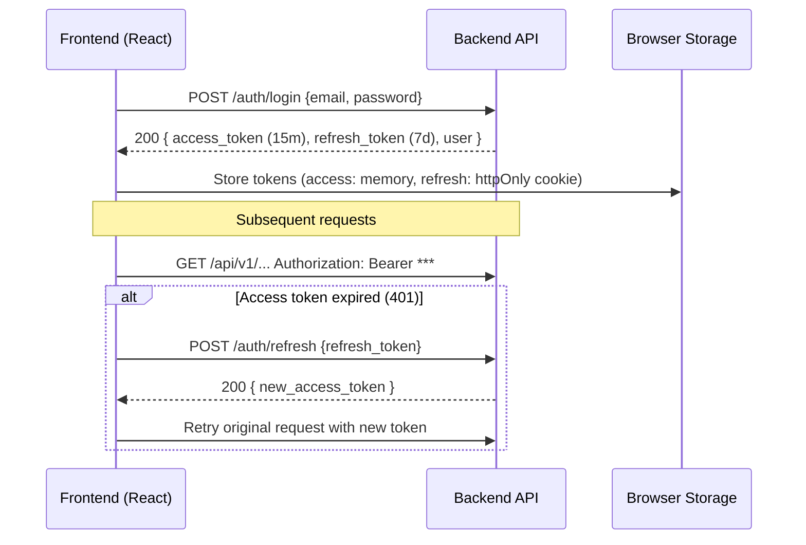

# File: 02-design/SDD/03-api-contract.md
# API Specification
## Property Management System

---

## 3. API Specification

### 3.1 API Conventions (กฎมาตรฐาน)
| Aspect | Rule |
|--------|------|
| **Base URL** | `https://{domain}/api/v1/` |
| **Versioning** | URL path versioning (`/v1/`). ไม่ใช้ Header versioning ในเฟส 1 |
| **Authentication** | `Authorization: Bearer *** (JWT, 15m expiry) |
| **Pagination** | Query: `?page=1&limit=20` → Response wrapper: `{ "data": [...], "meta": { "page", "limit", "total", "has_next" } }` |
| **Filtering/Sorting** | `?status=active&sort=-created_at` ( `-` = desc, `+` = asc) |
| **Response Format** | Success: `200/201 { data, meta }` <br> Error: `4xx/5xx { error: { code, message, details } }` |
| **Rate Limiting** | 100 req/min/IP → Header: `X-RateLimit-Limit`, `X-RateLimit-Remaining`, `Retry-After` |
| **Idempotency** | `POST` ที่มีผลข้างเคียงสูง (เช่น `record_payment`) รองรับ `Idempotency-Key` header |

### 3.2 Endpoint Summary (ตารางครบถ้วน)

| # | Method | Endpoint | Module | Auth | FR Coverage | Phase |
|---|--------|----------|--------|------|-------------|-------|
| 1 | POST | `/api/v1/auth/login` | auth | ❌ | FR-USER-01 | 1.0 |
| 2 | POST | `/api/v1/auth/register` | auth | ❌ | FR-USER-01 | 1.0 |
| 3 | POST | `/api/v1/auth/invite` | auth | ✅ | FR-USER-02 | 1.0 |
| 4 | POST | `/api/v1/auth/refresh` | auth | ❌ | FR-USER-01 | 1.0 |
| 5 | GET | `/api/v1/auth/me` | auth | ✅ | FR-USER-03 | 1.0 |
| 6 | POST | `/api/v1/properties` | property | ✅ | FR-PROP-01 | 1.0 |
| 7 | GET | `/api/v1/properties` | property | ✅ | FR-PROP-01 | 1.0 |
| 8 | GET | `/api/v1/properties/{id}` | property | ✅ | FR-PROP-02 | 1.0 |
| 9 | POST | `/api/v1/buildings` | property | ✅ | FR-PROP-02 | 1.0 |
| 10 | POST | `/api/v1/floors` | property | ✅ | FR-PROP-03 | 1.0 |
| 11 | POST | `/api/v1/rooms` | property | ✅ | FR-PROP-05 | 1.0 |
| 12 | GET | `/api/v1/rooms` | property | ✅ | FR-PROP-06 | 1.0 |
| 13 | POST | `/api/v1/meter-readings` | billing | ✅ | FR-METER-01~04 | 1.0 |
| 14 | GET | `/api/v1/meter-readings/history` | billing | ✅ | FR-METER-02 | 1.0 |
| 15 | POST | `/api/v1/invoices/bulk-generate` | billing | ✅ | FR-METER-07 | 1.0 |
| 16 | GET | `/api/v1/invoices` | billing | ✅ | FR-METER-10 | 1.0 |
| 17 | GET | `/api/v1/invoices/{id}` | billing | ✅ | FR-METER-10 | 1.0 |
| 18 | POST | `/api/v1/payments` | billing | ✅ | FR-METER-09 | 1.0 |
| 19 | POST | `/api/v1/tenants` | tenant | ✅ | FR-TENANT-01,02 | 1.0 |
| 20 | GET | `/api/v1/tenants/search` | tenant | ✅ | FR-TENANT-04 | 1.0 |
| 21 | POST | `/api/v1/contracts` | contract | ✅ | FR-CONTRACT-01 | 1.0 |
| 22 | POST | `/api/v1/contracts/{id}/terminate` | contract | ✅ | FR-CONTRACT-03 | 1.0 |
| 23 | GET | `/api/v1/dashboard` | dashboard | ✅ | FR-DASH-01 | 1.0 |
| 24 | GET | `/api/v1/reports/revenue` | dashboard | ✅ | FR-DASH-02 | 1.0 |
| 25 | GET | `/api/v1/reports/overdue` | dashboard | ✅ | FR-DASH-03 | 1.0 |
| 26 | POST | `/api/v1/maintenance` | maintenance | ✅ | FR-MAINT-01~03 | 1.5 |

> ✅ Total: 26 endpoints (25 for Phase 1.0, 1 for Phase 1.5)

### 3.3 Complete Endpoint Specifications (All 26 Endpoints)

เอกสารนี้ระบุสัญญา (Contract) ของทุก endpoint ในระบบ ตามมาตรฐาน §3.1 API Conventions

#### 🔐 Auth Module (5 Endpoints)

##### `POST /api/v1/auth/login`
| Attribute | Detail |
|-----------|--------|
| **Auth** | ❌ Not required (public) |
| **Request Body** | `AuthRequest`: `{ "email": "user@example.com", "password": "SecurePass123" }` |
| **Response (200)** | `TokenResponse`: `{ "data": { "access_token": "...", "refresh_token": "...", "user": { "id": "...", "email": "...", "property_scopes": ["..."] } } }` |
| **Status Codes** | `200` (success), `401` (AUTH-001: Invalid credentials), `403` (AUTH-002: Account inactive), `429` (Rate limited) |
| **Validation** | Email format, password strength (8+ chars, upper+lower+digit), account `is_active=True` |
| **Side Effects** | Log `user.logged_in` audit event with IP, user agent, timestamp |
| **Security** | Rate limit: 10 attempts/min/IP, Argon2id (OWASP 2026), JWT 15m expiry, refresh token 7d + rotation |

##### `POST /api/v1/auth/register`
| Attribute | Detail |
|-----------|--------|
| **Auth** | ❌ Not required (public) |
| **Request Body** | `RegisterRequest`: `{ "invite_token": "...", "full_name": "...", "password": "...", "phone": "..." }` |
| **Response (201)** | `UserResponse`: `{ "data": { "id": "...", "email": "...", "full_name": "..." }, "meta": null }` |
| **Status Codes** | `201` (created), `400` (VAL-001: Invalid token/password), `409` (AUTH-004: Email exists), `410` (AUTH-003: Token expired) |
| **Validation** | Invite token valid + not expired, password strength, phone uniqueness per property |
| **Side Effects** | Create User record, publish `user.registered` event, log `user.created` audit |
| **Security** | Token is JWT signed by backend, single-use, expires 7d |

##### `POST /api/v1/auth/invite`
| Attribute | Detail |
|-----------|--------|
| **Auth** | ✅ Required (Owner with property scope) |
| **Request Body** | `InviteRequest`: `{ "email": "newuser@example.com", "property_id": "uuid" }` |
| **Response (201)** | `InviteResponse`: `{ "data": { "invite_link": "https://app.com/auth/register?token=*** }, "meta": null }` |
| **Status Codes** | `201` (invite created), `400` (VAL-002: Invalid email), `403` (AUTH-005: Insufficient scope), `409` (AUTH-006: User already invited) |
| **Validation** | Email format, user must not exist, caller must own property |
| **Side Effects** | Generate JWT invite token (7d expiry), log `user.invited` audit, (optional) send email via external service |
| **Security** | Invite token contains property_id + email + expiry, signed by SECRET_KEY |

##### `POST /api/v1/auth/refresh`
| Attribute | Detail |
|-----------|--------|
| **Auth** | ❌ Not required (uses refresh token cookie) |
| **Request Body** | `{}` (refresh token sent via httpOnly cookie) |
| **Response (200)** | `RefreshResponse`: `{ "data": { "access_token": "..." }, "meta": null }` |
| **Status Codes** | `200` (refreshed), `401` (AUTH-007: Invalid/expired refresh token), `403` (AUTH-008: Token revoked) |
| **Validation** | Refresh token valid, not expired, `token_version` matches DB, user `is_active=True` |
| **Side Effects** | Increment `token_version` in DB (rotation), log `token.refreshed` audit |
| **Security** | Refresh token stored in httpOnly + Secure + SameSite=Strict cookie, 7d expiry, rotation on use |

##### `GET /api/v1/auth/me`
| Attribute | Detail |
|-----------|--------|
| **Auth** | ✅ Required (valid access token) |
| **Request Body** | None |
| **Response (200)** | `UserMeResponse`: `{ "data": { "id": "...", "email": "...", "full_name": "...", "property_scopes": ["..."], "is_active": true }, "meta": null }` |
| **Status Codes** | `200` (success), `401` (AUTH-009: Invalid/expired access token) |
| **Validation** | Access token valid, user exists and `is_active=True` |
| **Side Effects** | None (read-only) |
| **Security** | Token verified via `get_current_user` dependency, scopes checked per endpoint |

---

#### 🏢 Property Module (7 Endpoints)

##### `POST /api/v1/properties`
| Attribute | Detail |
|-----------|--------|
| **Auth** | ✅ Required (Owner) |
| **Request Body** | `PropertyCreate`: `{ "name": "...", "address": "...", "billing_due_day": 5, "min_deposit_months": 2 }` |
| **Response (201)** | `PropertyResponse`: `{ "data": { "id": "...", "name": "...", ... }, "meta": null }` |
| **Status Codes** | `201` (created), `400` (VAL-003: billing_due_day out of range), `403` (AUTH-005: Insufficient scope) |
| **Validation** | `1 <= billing_due_day <= 28`, `min_deposit_months >= 1`, name not empty |
| **Side Effects** | Create Property record, log `property.created` audit, assign caller as owner |
| **Security** | Caller becomes owner, cannot transfer ownership in MVP |

##### `GET /api/v1/properties`
| Attribute | Detail |
|-----------|--------|
| **Auth** | ✅ Required (Owner) |
| **Response (200)** | `PropertyListResponse`: `{ "data": [ { "id": "...", "name": "...", "address": "...", "billing_due_day": 5, "min_deposit_months": 2, ... } ], "meta": null }` |
| **Status Codes** | `200` (success), `403` (AUTH-005: Insufficient scope) |
| **Side Effects** | None (read-only) |
| **Security** | Returns all properties visible to the caller |

##### `GET /api/v1/properties/{id}`
| Attribute | Detail |
|-----------|--------|
| **Auth** | ✅ Required (Owner with property scope) |
| **Path Params** | `id` (property UUID) |
| **Response (200)** | `PropertyResponse`: `{ "data": { "id": "...", "name": "...", "address": "...", "billing_due_day": 5, "min_deposit_months": 2, "created_by": "...", "created_at": "...", "updated_at": "..." }, "meta": null }` |
| **Status Codes** | `200` (success), `403` (AUTH-005: Insufficient scope), `404` (NOT-FOUND: property not found) |
| **Validation** | `id` must be a valid UUID, property must exist and belong to caller's scope |
| **Side Effects** | None (read-only) |
| **Security** | Caller must have scope for the requested property |

##### `POST /api/v1/buildings`
| Attribute | Detail |
|-----------|--------|
| **Auth** | ✅ Required (Owner with property scope) |
| **Request Body** | `BuildingCreate`: `{ "property_id": "uuid", "name": "...", "display_order": 1, "description": "..." }` |
| **Response (201)** | `BuildingResponse`: `{ "data": { "id": "...", "name": "...", ... }, "meta": null }` |
| **Status Codes** | `201` (created), `400` (VAL-004: property_id not found), `403` (AUTH-005: Insufficient scope) |
| **Validation** | `property_id` exists and caller owns it, name not empty |
| **Side Effects** | Create Building record, log `building.created` audit |
| **Security** | Caller must have scope for `property_id` |

##### `POST /api/v1/floors`
| Attribute | Detail |
|-----------|--------|
| **Auth** | ✅ Required (Owner with property scope) |
| **Request Body** | `FloorCreate`: `{ "building_id": "uuid", "name": "...", "display_order": 1, "description": "..." }` |
| **Response (201)** | `FloorResponse`: `{ "data": { "id": "...", "name": "...", ... }, "meta": null }` |
| **Status Codes** | `201` (created), `400` (VAL-005: building_id not found), `403` (AUTH-005: Insufficient scope) |
| **Validation** | `building_id` exists and belongs to property caller owns |
| **Side Effects** | Create Floor record, log `floor.created` audit |
| **Security** | Caller must have scope for building's property |

##### `POST /api/v1/rooms`
| Attribute | Detail |
|-----------|--------|
| **Auth** | ✅ Required (Owner with property scope) |
| **Request Body** | `RoomCreate`: `{ "property_id": "uuid", "building_id": "uuid", "floor_id": "uuid?", "room_number": "101", "room_type": "studio", "base_rent": 5000.00, "images": [...] }` |
| **Response (201)** | `RoomResponse`: `{ "data": { "id": "...", "room_number": "101", "status": "available", ... }, "meta": null }` |
| **Status Codes** | `201` (created), `400` (VAL-006: floor_id invalid / room_number format), `403` (AUTH-005), `409` (PROP-001: room_number exists in building) |
| **Validation** | BR-11: `room_number` unique per `building_id`, BR-12: `floor_id` required if building has floors, `base_rent >= 0` |
| **Side Effects** | Create Room record (status=`available`), log `room.created` audit |
| **Security** | Caller must have scope for `property_id` |

##### `GET /api/v1/rooms`
| Attribute | Detail |
|-----------|--------|
| **Auth** | ✅ Required (Owner with property scope) |
| **Query Params** | `property_id?`, `building_id?`, `floor_id?`, `status?` (available/occupied/maintenance), `room_type?`, `page=1`, `limit=20`, `sort=-created_at` |
| **Response (200)** | `RoomListResponse`: `{ "data": [RoomResponse], "meta": { "page", "limit", "total", "has_next" } }` |
| **Status Codes** | `200` (success), `400` (VAL-007: invalid filter value), `403` (AUTH-005) |
| **Validation** | Filter values must match enum/types, pagination params within bounds |
| **Side Effects** | None (read-only) |
| **Security** | Results filtered by caller's `property_scopes` |

---

#### 💰 Billing Module (6 Endpoints)

##### `POST /api/v1/meter-readings`
| Attribute | Detail |
|-----------|--------|
| **Auth** | ✅ Required (Owner with property scope) |
| **Request Body** | `MeterReadingCreate`: `{ "room_id": "uuid", "billing_month": 5, "billing_year": 2026, "electric_current": 1250.5, "water_current": 42.0 }` |
| **Response (201)** | `MeterReadingResponse`: `{ "data": { "id": "...", "electric_used": 12.5, "water_used": 3.0 }, "meta": null }` |
| **Status Codes** | `201` (created), `400` (BILL-001: current < previous), `403` (AUTH-005), `409` (BILL-002: duplicate for room/month/year) |
| **Validation** | BR-07: `electric_current >= previous.electric_current`, same for water; unique `(room_id, billing_month, billing_year)` |
| **Side Effects** | Create MeterReading record, calculate `electric_used`/`water_used`, publish `meter.recorded` event, log `meter_reading.recorded` audit |
| **Security** | Room must belong to property in caller's scopes |

##### `GET /api/v1/meter-readings/history`
| Attribute | Detail |
|-----------|--------|
| **Auth** | ✅ Required (Owner with property scope) |
| **Query Params** | `room_id` (required), `start_month?`, `start_year?`, `end_month?`, `end_year?`, `page=1`, `limit=20` |
| **Response (200)** | `MeterReadingListResponse`: `{ "data": [MeterReadingResponse], "meta": { "page", "limit", "total", "has_next" } }` |
| **Status Codes** | `200` (success), `400` (VAL-008: invalid date range), `403` (AUTH-005), `404` (NOT-FOUND: room not found) |
| **Validation** | `room_id` exists and belongs to caller's property, date range valid |
| **Side Effects** | None (read-only) |
| **Security** | Results filtered by caller's scopes |

##### `POST /api/v1/invoices/bulk-generate`
| Attribute | Detail |
|-----------|--------|
| **Auth** | ✅ Required (Owner) |
| **Request Body** | `BulkInvoiceRequest`: `{ "property_id": "uuid", "billing_month": 5, "billing_year": 2026 }` |
| **Response (202)** | `TaskResponse`: `{ "data": { "task_id": "uuid", "status_url": "/api/v1/tasks/{task_id}" }, "meta": null }` |
| **Status Codes** | `202` (queued), `400` (VAL-009: invalid month/year), `403` (AUTH-005), `409` (BILL-004: already generated) |
| **Validation** | Month 1-12, year >= 2020, property exists and caller owns it, no invoices exist for that month |
| **Side Effects** | Queue Celery task, publish `invoice.bulk_generation_started` event, log `invoice.bulk_generate_requested` audit |
| **Idempotency** | Supports `Idempotency-Key` header to prevent duplicate generation |

##### `GET /api/v1/invoices`
| Attribute | Detail |
|-----------|--------|
| **Auth** | ✅ Required (Owner with property scope) |
| **Query Params** | `property_id?`, `status?` (draft/sent/paid/overdue/cancelled), `tenant_id?`, `month?`, `year?`, `page=1`, `limit=20`, `sort=-due_date` |
| **Response (200)** | `InvoiceListResponse`: `{ "data": [InvoiceResponse], "meta": { "page", "limit", "total", "has_next" } }` |
| **Status Codes** | `200` (success), `400` (VAL-010: invalid filter), `403` (AUTH-005) |
| **Validation** | Filter values match enums/types |
| **Side Effects** | None (read-only) |
| **Security** | Results filtered by caller's scopes |

##### `GET /api/v1/invoices/{id}`
| Attribute | Detail |
|-----------|--------|
| **Auth** | ✅ Required (Owner with property scope) |
| **Path Params** | `id` (invoice UUID) |
| **Response (200)** | `InvoiceDetailResponse`: `{ "data": { ...InvoiceResponse..., "line_items": [LineItemResponse] }, "meta": null }` |
| **Status Codes** | `200` (success), `403` (AUTH-005), `404` (NOT-FOUND: invoice not found) |
| **Validation** | Invoice exists and belongs to property in caller's scopes |
| **Side Effects** | None (read-only) |
| **Security** | Caller must have scope for invoice's property |

##### `POST /api/v1/payments`
| Attribute | Detail |
|-----------|--------|
| **Auth** | ✅ Required (Owner with property scope) |
| **Request Body** | `PaymentCreate`: `{ "invoice_id": "uuid", "amount": 5000.00, "method": "bank_transfer", "reference_number": "TXN123", "slip_image_url": "https://...", "notes": "..." }` |
| **Response (201)** | `PaymentResponse`: `{ "data": { "id": "...", "amount": 5000.00, "payment_date": "2026-05-24", ... }, "meta": null }` |
| **Status Codes** | `201` (created), `400` (VAL-011: amount <= 0 / invalid method), `403` (AUTH-005), `404` (NOT-FOUND: invoice not found), `409` (BILL-005: invoice already fully paid) |
| **Validation** | `amount > 0`, `method` in enum, invoice exists and is not cancelled, `amount <= invoice.total_amount - invoice.paid_amount` |
| **Side Effects** | Create Payment record, update `invoice.paid_amount`, publish `payment.recorded` event, log `payment.recorded` audit, trigger invoice status update if fully paid |
| **Idempotency** | Supports `Idempotency-Key` header |

---

#### 👥 Tenant Module (2 Endpoints)

##### `POST /api/v1/tenants`
| Attribute | Detail |
|-----------|--------|
| **Auth** | ✅ Required (Owner with property scope) |
| **Request Body** | `TenantCreate`: `{ "property_id": "uuid", "full_name": "...", "id_card_number": "...", "phone": "...", "email": "...", "emergency_contact_name": "...", "emergency_contact_phone": "..." }` |
| **Response (201)** | `TenantResponse`: `{ "data": { "id": "...", "full_name": "...", "phone": "...", ... }, "meta": null }` (note: `id_card_number` NOT returned) |
| **Status Codes** | `201` (created), `400` (VAL-012: invalid ID card format / phone format), `403` (AUTH-005), `409` (TENANT-001: phone already registered in property) |
| **Validation** | Thai ID card 13 digits + checksum, phone format, email format if provided, phone unique per property |
| **Side Effects** | Create Tenant record with `id_card_number` encrypted via Fernet, log `tenant.created` audit |
| **Security** | ID card encrypted at rest, never returned in API responses |

##### `GET /api/v1/tenants/search`
| Attribute | Detail |
|-----------|--------|
| **Auth** | ✅ Required (Owner with property scope) |
| **Query Params** | `property_id` (required), `query` (required, min 3 chars), `search_by` (name/phone/email, default=name), `page=1`, `limit=20` |
| **Response (200)** | `TenantListResponse`: `{ "data": [TenantResponse], "meta": { "page", "limit", "total", "has_next" } }` |
| **Status Codes** | `200` (success), `400` (VAL-013: query too short / invalid search_by), `403` (AUTH-005) |
| **Validation** | `query` length >= 3, `search_by` in enum |
| **Side Effects** | None (read-only) |
| **Security** | Results filtered by `property_id` + caller's scopes; `id_card_number` never included in response |

---

#### 📄 Contract Module (3 Endpoints)

##### `POST /api/v1/contracts`
| Attribute | Detail |
|-----------|--------|
| **Auth** | ✅ Required (Owner with property scope) |
| **Request Body** | `ContractCreate`: `{ "room_id": "uuid", "tenant_id": "uuid", "start_date": "2026-06-01", "end_date": "2027-05-31", "monthly_rent": 5000.00, "deposit_amount": 10000.00, "special_conditions": "..." }` |
| **Response (201)** | `ContractResponse`: `{ "data": { "id": "...", "status": "active", "room_status_updated": true }, "meta": null }` |
| **Status Codes** | `201` (created), `400` (CONT-002: deposit too low / CONT-003: date overlap), `403` (AUTH-005), `404` (NOT-FOUND: room/tenant not found), `409` (CONT-001: room has active contract) |
| **Validation** | BR-01: room has no active contract, BR-02: `deposit_amount >= monthly_rent * property.min_deposit_months`, dates valid and `start_date < end_date`, room status = `available` |
| **Side Effects** | Create Contract record (status=`active`), update Room.status → `occupied`, publish `contract.created` event, log `contract.created` audit |
| **Security** | Room and tenant must belong to property in caller's scopes |

##### `POST /api/v1/contracts/{id}/terminate`
| Attribute | Detail |
|-----------|--------|
| **Auth** | ✅ Required (Owner with property scope) |
| **Path Params** | `id` (contract UUID) |
| **Request Body** | `ContractTerminateRequest`: `{ "reason": "tenant_moved_out", "termination_date": "2026-05-31" }` |
| **Response (200)** | `ContractResponse`: `{ "data": { "id": "...", "status": "terminated", "room_status_updated": true }, "meta": null }` |
| **Status Codes** | `200` (terminated), `400` (VAL-014: reason required / invalid date), `403` (AUTH-005), `404` (NOT-FOUND), `409` (CONT-004: contract not active) |
| **Validation** | Contract exists, status=`active`, `termination_date` between start/end dates, reason not empty |
| **Side Effects** | Update Contract.status → `terminated`, update Room.status → `available`, publish `contract.terminated` event, log `contract.terminated` audit |
| **Security** | Caller must have scope for contract's property |

##### `POST /api/v1/contracts/{id}/renew`
| Attribute | Detail |
|-----------|--------|
| **Auth** | ✅ Required (Owner with property scope) |
| **Path Params** | `id` (contract UUID) |
| **Request Body** | `ContractRenewRequest`: `{ "new_start_date": "2027-06-01", "new_end_date": "2028-05-31", "new_monthly_rent": 5200.00, "new_deposit_amount": 10400.00 }` |
| **Response (201)** | `ContractResponse`: `{ "data": { "id": "...", "status": "active", "is_renewal": true }, "meta": null }` |
| **Status Codes** | `201` (new contract created), `400` (CONT-002: deposit too low / CONT-003: date overlap), `403` (AUTH-005), `404` (NOT-FOUND), `409` (CONT-005: original contract not terminated/expired) |
| **Validation** | Original contract exists and is `terminated` or `expired`, new dates valid, new deposit meets BR-02, room still available |
| **Side Effects** | Create NEW Contract record (does not modify original), keep Room.status = `occupied`, publish `contract.renewed` event, log `contract.renewed` audit |
| **Security** | Caller must have scope for property; original and new contract reference same room/tenant |

---

#### 📊 Dashboard Module (3 Endpoints)

##### `GET /api/v1/dashboard`
| Attribute | Detail |
|-----------|--------|
| **Auth** | ✅ Required (Owner with property scope) |
| **Query Params** | `property_id` (required), `as_of_date?` (default=today) |
| **Response (200)** | `DashboardResponse`: `{ "data": { "occupancy_rate": 85.5, "total_rooms": 50, "occupied_rooms": 43, "monthly_revenue": 215000.00, "overdue_count": 3, "overdue_amount": 15000.00 }, "meta": null }` |
| **Status Codes** | `200` (success), `400` (VAL-015: invalid date), `403` (AUTH-005), `404` (DASH-002: property not found) |
| **Validation** | `property_id` exists and caller has scope, `as_of_date` not in future |
| **Side Effects** | None (read-only aggregations) |
| **Security** | Aggregations filtered by caller's scopes |

##### `GET /api/v1/reports/revenue`
| Attribute | Detail |
|-----------|--------|
| **Auth** | ✅ Required (Owner with property scope) |
| **Query Params** | `property_id` (required), `start_date`, `end_date`, `group_by` (day/week/month, default=month) |
| **Response (200)** | `RevenueReportResponse`: `{ "data": [ { "period": "2026-05", "revenue": 215000.00, "payments_count": 43 } ], "meta": { "total_revenue": 215000.00 } }` |
| **Status Codes** | `200` (success), `400` (DASH-001: end_date < start_date / invalid group_by), `403` (AUTH-005), `404` (DASH-002) |
| **Validation** | Date range valid, `group_by` in enum |
| **Side Effects** | None (read-only) |
| **Security** | Results filtered by caller's scopes |

##### `GET /api/v1/reports/overdue`
| Attribute | Detail |
|-----------|--------|
| **Auth** | ✅ Required (Owner with property scope) |
| **Query Params** | `property_id` (required), `days_overdue?` (default=1, min=1), `page=1`, `limit=20` |
| **Response (200)** | `OverdueReportResponse`: `{ "data": [ { "invoice_id": "...", "tenant_name": "...", "room_number": "101", "due_date": "2026-05-05", "amount_due": 5000.00, "days_overdue": 19 } ], "meta": { "page", "limit", "total", "has_next" } }` |
| **Status Codes** | `200` (success), `400` (VAL-016: days_overdue < 1), `403` (AUTH-005), `404` (DASH-002) |
| **Validation** | `property_id` exists, `days_overdue >= 1` |
| **Side Effects** | None (read-only) |
| **Security** | Results filtered by caller's scopes; sensitive tenant data masked per policy |

---

#### 🔧 Maintenance Module (1 Endpoint — Phase 1.5)

##### `POST /api/v1/maintenance`
| Attribute | Detail |
|-----------|--------|
| **Auth** | ✅ Required (Owner with property scope) |
| **Request Body** | `MaintenanceRequestCreate`: `{ "room_id": "uuid", "title": "แอร์ไม่เย็น", "description": "...", "priority": "medium", "images": [...] }` |
| **Response (201)** | `MaintenanceRequestResponse`: `{ "data": { "id": "...", "status": "pending", "title": "...", ... }, "meta": null }` |
| **Status Codes** | `201` (created), `400` (MAINT-002: >5 images / title too long), `403` (AUTH-005), `404` (NOT-FOUND: room not found) |
| **Validation** | `room_id` exists and belongs to caller's property, `priority` in enum, `images` <= 5, each image <= 5MB |
| **Side Effects** | Create MaintenanceRequest record (status=`pending`), publish `maintenance.created` event, log `maintenance_request.created` audit |
| **Security** | Room must belong to property in caller's scopes; images uploaded to MinIO with restricted ACL |

---

#### 🌐 Global Error Format (All Endpoints)
ทุก endpoint ที่คืนสถานะ 4xx/5xx ใช้รูปแบบเดียวกัน:
```json
{
  "error": {
    "code": "ERROR_CODE",
    "message": "Human-readable message in English",
    "details": {
      "field": "optional field-specific context"
    }
  }
}
```

| Error Code Prefix | HTTP Status | Meaning | Frontend Action (§3.5.2) |
|------------------|-------------|---------|-------------------------|
| `AUTH-xxx` | 401/403 | Authentication/Authorization failure | Redirect to `/login` or show session modal |
| `VAL-xxx` | 400 | Validation error (Pydantic/Business rule) | Show inline form error + tooltip |
| `FR-xxx` / `BR-xxx` | 400/409 | Business rule violation | Show toast with message from `GLOSSARY.md` |
| `NOT-FOUND` | 404 | Resource not found | Show 404 page or inline "not found" message |
| `CONFLICT` | 409 | Conflict with existing resource | Show toast + suggest alternative action |
| `SYS-xxx` | 500 | Internal server error | Show generic error + log to monitoring |

> ℹ️ **หมายเหตุ:** Frontend ใช้ `error.code` เป็น key สำหรับ i18n translation ตาม §3.5.2

---

#### 📐 Response Format Standard (All Endpoints)
| Type | Success Format | Error Format |
|------|---------------|-------------|
| **CREATE (201)** | `{ "data": { <resource> }, "meta": null }` | `{ "error": { "code", "message", "details?" } }` |
| **READ List (200)** | `{ "data": [<resource>], "meta": { "page", "limit", "total", "has_next" } }` | Same as above |
| **READ Detail (200)** | `{ "data": { <resource> }, "meta": null }` | Same as above |
| **UPDATE (200)** | `{ "data": { <resource> }, "meta": null }` | Same as above |
| **DELETE (204)** | No content (empty body) | Same as above |
| **ASYNC (202)** | `{ "data": { "task_id", "status_url" }, "meta": null }` | Same as above |

> ✅ **กฎ:** ทุก endpoint ต้องใช้รูปแบบนี้ — ไม่ใช้รูปแบบอื่นเพื่อป้องกัน Frontend/Backend drift

### 3.4 OpenAPI Contract Reference
- เอกสารนี้ระบุเฉพาะ **Conventions + Critical Endpoints** เพื่อความกระชับ
- **Full API Contract** จะถูก generate อัตโนมัติจาก FastAPI → `/docs` (Swagger UI) และ `/openapi.json`
- Frontend/CI จะใช้ `openapi.json` เป็น source of truth สำหรับ:
  - Generate TypeScript API client (`openapi-typescript`)
  - Contract testing ใน CI (`schemathesis` / `pytest-openapi`)
  - Mock server สำหรับพัฒนา Frontend คู่ขนาน

### 3.5 Frontend Integration Contract

#### 3.5.1 Authentication Flow (JWT + Refresh)


**Contract Rules for Frontend:**
- เก็บ `access_token` ใน memory เท่านั้น (ไม่เก็บใน localStorage เพื่อลด XSS risk)
- เก็บ `refresh_token` ใน httpOnly + Secure + SameSite=Strict cookie
- เมื่อได้ 401 → ลอง refresh 1 ครั้ง → ถ้ายังล้มเหลว → redirect ไปหน้า login
- เพิ่ม `X-Request-ID` header ในทุกคำขอเพื่อ trace กับ backend log

#### 3.5.2 Error Handling Format & Frontend Behavior
```json
{
  "error": {
    "code": "FR-METER-05",
    "message": "Utility rate not found for scope room:abc123",
    "details": { "scope_type": "room", "scope_id": "abc123" }
  }
}
```

| Error Prefix | Frontend Behavior | i18n Mapping |
|--------------|-------------------|--------------|
| `FR-xxx` / `BR-xxx` | แสดงข้อความจาก `GLOSSARY.md` (Business Rule/Requirement) | `error.business.FR-METER-05` |
| `VAL-xxx` | แสดงข้อผิดพลาดแบบฟอร์ม (field-level) | `error.validation.VAL-01` |
| `AUTH-xxx` | Redirect to `/login` หรือแสดง session expired modal | `error.auth.AUTH-001` |
| `SYS-xxx` | แสดง "เกิดข้อผิดพลาดในระบบ กรุณาลองใหม่" + Log to monitoring | `error.system.SYS-01` |

#### 3.5.3 Offline Sync Strategy (PWA Critical Flow)
| Scenario | Frontend Behavior | Backend Expectation |
|----------|------------------|-------------------|
| จดมิเตอร์ตอนออฟไลน์ | เก็บใน IndexedDB queue → แสดง "✅ บันทึกแล้ว (รอซิงค์)" | ไม่รู้เรื่อง → รอรับ request ปกติเมื่อออนไลน์ |
| ออนไลน์กลับมา | Background Sync API → POST queue items ทีละตัว | รับ request ปกติ → ตอบ 201 → Frontend ลบจาก queue |
| Sync ล้มเหลว | Retry with exponential backoff (max 3 ครั้ง) → แจ้งผู้ใช้ถ้ายังล้ม | ตอบ 4xx/5xx → Frontend จัดการตามสถานะ |

#### 3.5.4 API Client Generation (Contract-First Workflow)
```bash
# CI Pipeline: Generate TypeScript types from OpenAPI
- name: Generate API client
  run: |
    npx openapi-typescript http://localhost:8000/openapi.json -o frontend/src/types/api.d.ts
    # Frontend ใช้ types นี้สำหรับ type-safe API calls
```

**Frontend Usage Example (Auto-generated Types):**
```typescript
// frontend/src/features/billing/api.ts
import type { paths } from '@/types/api'
import { apiClient } from '@/shared/api'

export const recordMeterReading = async (
  payload: paths['/api/v1/meter-readings']['post']['requestBody']['content']['application/json']
): Promise<paths['/api/v1/meter-readings']['post']['responses']['201']['content']['application/json']> => {
  const { data } = await apiClient.post('/api/v1/meter-readings', payload)
  return data
}
```

> ✅ **ประโยชน์:**  
> - Backend แก้ OpenAPI spec → Frontend ได้ type อัปเดตอัตโนมัติ  
> - ลดความผิดพลาดจาก "คิดว่า endpoint นี้ส่ง field นี้"  
> - Contract testing ใน CI: `schemathesis run http://localhost:8000/openapi.json`