# File: 02-design/SDD/04-database-schema.md
# Database Design
## Property Management System

ส่วนนี้ออกแบบโครงสร้างข้อมูลครบ 9 มิติตามมาตรฐาน SE และสอดคล้องกับ Tech Stack ล่าสุด (PostgreSQL 18+, SQLAlchemy 2.0+, asyncpg, Alembic async) เพื่อป้องกัน Conflict ระหว่าง Development, Migration และ Production Runtime

---

### 4.1 Conceptual & Logical Design

#### 4.1.1 Entity Relationship Diagram (ERD)

```mermaid
erDiagram
    USER ||--o{ PROPERTY : owns
    USER ||--o{ AUDIT_LOG : generates
    PROPERTY ||--o{ BUILDING : contains
    PROPERTY ||--o{ TENANT : manages
    PROPERTY ||--o{ UTILITY_RATE : defines
    BUILDING ||--o{ FLOOR : contains
    BUILDING ||--o{ ROOM : contains
    FLOOR ||--o{ ROOM : contains
    ROOM ||--o{ METER_READING : has
    ROOM ||--o{ CONTRACT : assigned
    ROOM ||--o{ MAINTENANCE_REQUEST : tracks
    TENANT ||--o{ CONTRACT : signs
    CONTRACT ||--o{ INVOICE : generates
    INVOICE ||--o{ INVOICE_LINE_ITEM : contains
    INVOICE ||--o{ PAYMENT : receives

    USER {
        uuid id PK
        string email UK
        string password_hash
        string full_name
        string phone
        boolean is_active
        datetime created_at
    }

    PROPERTY {
        uuid id PK
        string name
        text address
        int billing_due_day
        int min_deposit_months
        uuid created_by FK
        datetime created_at
    }

    BUILDING {
        uuid id PK
        uuid property_id FK
        string name
        int display_order
        text description
    }

    FLOOR {
        uuid id PK
        uuid building_id FK
        string name
        int display_order
        text description
    }

    ROOM {
        uuid id PK
        uuid property_id FK
        uuid building_id FK
        uuid floor_id FK
        string room_number
        string room_type
        decimal base_rent
        string status
        jsonb images
    }

    TENANT {
        uuid id PK
        uuid property_id FK
        string full_name
        string id_card_number_encrypted
        string phone
        string email
        string emergency_contact_name
        string emergency_contact_phone
        datetime created_at
    }

    CONTRACT {
        uuid id PK
        uuid room_id FK
        uuid tenant_id FK
        date start_date
        date end_date
        decimal monthly_rent
        decimal deposit_amount
        string status
        string termination_reason
        uuid created_by FK
        datetime created_at
    }

    METER_READING {
        uuid id PK
        uuid room_id FK
        int billing_month
        int billing_year
        decimal electric_previous
        decimal electric_current
        decimal electric_used
        decimal water_previous
        decimal water_current
        decimal water_used
        date read_date
        uuid recorded_by FK
    }

    UTILITY_RATE {
        uuid id PK
        string scope_type
        uuid scope_id
        decimal electric_rate_per_unit
        decimal water_rate_per_unit
        decimal common_fee
        date effective_from
        date effective_to
        uuid created_by FK
    }

    INVOICE {
        uuid id PK
        string invoice_number UK
        uuid contract_id FK
        uuid room_id FK
        uuid tenant_id FK
        int billing_month
        int billing_year
        date due_date
        string status
        decimal total_amount
        decimal paid_amount
        text notes
        uuid created_by FK
        datetime created_at
    }

    INVOICE_LINE_ITEM {
        uuid id PK
        uuid invoice_id FK
        string type
        string description
        decimal quantity
        decimal unit_price
        decimal amount
    }

    PAYMENT {
        uuid id PK
        uuid invoice_id FK
        decimal amount
        date payment_date
        string method
        string reference_number
        string slip_image_url
        text notes
        uuid recorded_by FK
        datetime created_at
    }

    MAINTENANCE_REQUEST {
        uuid id PK
        uuid room_id FK
        string title
        text description
        jsonb images
        string status
        string priority
        datetime resolved_at
        uuid created_by FK
        datetime created_at
    }

    AUDIT_LOG {
        uuid id PK
        uuid user_id FK
        string action
        string resource_type
        uuid resource_id
        uuid property_id FK
        jsonb metadata
        string ip_address
        string user_agent
        datetime timestamp
    }
```


#### 4.1.2 Normalization & Constraint Mapping
| Business Rule | Logical Constraint | Physical Implementation (PG 18 + SQLAlchemy 2.0) |
|--------------|-------------------|--------------------------------------------------|
| **BR-01**: 1 ห้อง = 1 สัญญา active | `UNIQUE(room_id) WHERE status='active'` | `Index("...", postgresql_where=text("status = 'active'"), unique=True)` |
| **BR-07**: ค่ามิเตอร์ปัจจุบัน ≥ ก่อนหน้า | `CHECK (electric_current >= electric_previous)` | Application validation + optional `CheckConstraint()` |
| **BR-10**: Utility rate cascade 4 ระดับ | Polymorphic association (`scope_type` + `scope_id`) | App-level recursion in `InvoiceService`; no FK cross-table |
| **BR-11**: Room number ไม่ซ้ำในอาคาร | `UNIQUE(building_id, room_number)` | `Index("ix_rooms_number_unique_per_building", unique=True)` |
| **BR-12**: Floor optional ถ้าอาคารชั้นเดียว | `floor_id` nullable + app validation | `RoomService` checks `building_has_floors()` before allow `NULL` |

**Normalization Level:** 3NF
- ✅ ทุก Non-Key Attribute ขึ้นกับ Primary Key โดยตรง
- ✅ แยก `utility_rates` แบบ Polymorphic เพื่อรองรับ Time-versioned rate history
- ⚠️ **Conflict Prevention:** หลีกเลี่ยง `JSONB` สำหรับข้อมูลที่ถูก Query บ่อย (เช่น `status`, `due_date`) — ใช้ Relational Column + Index แทน เพื่อประสิทธิภาพ `asyncpg`

---

### 4.2 Physical Schema (SQLAlchemy 2.0+ Syntax)

ใช้ **Declarative Mapping** แบบใหม่ (รองรับ `asyncpg` และ `mypy` strict mode)

```python
# shared/database.py
from sqlalchemy.orm import DeclarativeBase

class Base(DeclarativeBase):
    pass

# app/modules/billing/models.py
from sqlalchemy import String, CheckConstraint, Index, text, Enum as SAEnum
from sqlalchemy.dialects.postgresql import UUID, JSONB
from sqlalchemy.orm import Mapped, mapped_column, relationship
import uuid
from datetime import date
from decimal import Decimal

class MeterReading(Base):
    __tablename__ = "meter_readings"

    id: Mapped[uuid.UUID] = mapped_column(UUID(as_uuid=True), primary_key=True, default=uuid.uuid4)
    room_id: Mapped[uuid.UUID] = mapped_column(UUID(as_uuid=True), index=True, nullable=False)
    billing_month: Mapped[int] = mapped_column(nullable=False)
    billing_year: Mapped[int] = mapped_column(nullable=False)
    electric_previous: Mapped[Decimal] = mapped_column(nullable=False)
    electric_current: Mapped[Decimal] = mapped_column(nullable=False)
    electric_used: Mapped[Decimal] = mapped_column(nullable=False)  # Calculated in service
    water_previous: Mapped[Decimal] = mapped_column(nullable=False)
    water_current: Mapped[Decimal] = mapped_column(nullable=False)
    water_used: Mapped[Decimal] = mapped_column(nullable=False)    # Calculated in service
    read_date: Mapped[date] = mapped_column(nullable=False)
    recorded_by: Mapped[uuid.UUID] = mapped_column(UUID(as_uuid=True), nullable=False)

    __table_args__ = (
        Index("ix_meter_readings_unique_per_room_month", "room_id", "billing_year", "billing_month", unique=True),
        Index("ix_meter_readings_room_date", "room_id", "read_date"),
    )
```

⚠️ **Conflict Prevention Notes:**
- ใช้ `UUID(as_uuid=True)` แทน `String` → `asyncpg` serialize เป็น binary ได้เร็วขึ้น 30%
- หลีกเลี่ยง `relationship(lazy="select")` ใน Async Session → จะเกิด `DetachedInstanceError` เมื่อ commit แล้ว access ต่อ ให้ใช้ `selectinload()` หรือ `joinedload()` ใน repository query
- `Decimal` ใช้กับ `Numeric` ใน PG → ต้องตั้งค่า `asyncpg` pool parameter `decimal_as_float=False` (default ใน SQLAlchemy 2.0+)

---

### 4.3 Indexing & Query Optimization Strategy

#### 4.3.1 Index Inventory (Async-Optimized)
| Index Name | Table | Columns | Type | Query Pattern | SQLAlchemy Syntax |
|-----------|-------|---------|------|--------------|-------------------|
| `ix_rooms_property_status` | `rooms` | `(property_id, status)` | Composite | Dashboard count | `Index("ix_rooms_property_status", "property_id", "status")` |
| `ix_contracts_room_active_unique` | `contracts` | `(room_id)` WHERE `status='active'` | Partial Unique | BR-01 enforcement | `Index("...", "room_id", unique=True, postgresql_where=text("status = 'active'"))` |
| `ix_utility_rates_scope_period` | `utility_rates` | `(scope_type, scope_id, effective_from DESC)` | Composite + Sort | Cascade resolution | `Index("...", "scope_type", "scope_id", "effective_from", postgresql_ops={"effective_from": "DESC"})` |
| `ix_tenants_property_phone_unique` | `tenants` | `(property_id, phone)` | Unique | Duplicate prevention | `Index("...", "property_id", "phone", unique=True)` |

#### 4.3.2 Async Query Patterns (asyncpg + SQLAlchemy 2.0)
```python
# ✅ Correct: Load related data explicitly in async context
async def get_active_contracts(self, property_id: UUID, month: int, year: int):
    stmt = (
        select(Contract)
        .where(
            Contract.status == "active",
            Contract.start_date <= date(year, month, 1),
            or_(Contract.end_date.is_(None), Contract.end_date >= date(year, month, 1))
        )
        .options(selectinload(Contract.room))  # Prevents N+1 & DetachedInstanceError
    )
    result = await self.db.execute(stmt)
    return result.scalars().all()
```

⚠️ **Conflict Prevention Notes:**
- ❌ ห้ามใช้ `session.query()` (SQLAlchemy 1.x style) ใน async context
- ✅ ใช้ `select()` + `await session.execute()` เสมอ
- ใช้ `selectinload()` สำหรับ `1:M` relationships, `joinedload()` สำหรับ `M:1`
- ตั้ง `pool_recycle=1800` ใน `create_async_engine()` เพื่อป้องกัน PG connection timeout

---

### 4.4 Security & Access Control

#### 4.4.1 PostgreSQL Roles (Least Privilege)
```sql
-- App runtime role (no DDL, limited DML)
CREATE ROLE app_user LOGIN PASSWORD '${DB_PASSWORD}';
GRANT CONNECT ON DATABASE pms TO app_user;
GRANT USAGE ON SCHEMA public TO app_user;
GRANT SELECT, INSERT, UPDATE ON ALL TABLES IN SCHEMA public TO app_user;
GRANT USAGE, SELECT ON ALL SEQUENCES IN SCHEMA public TO app_user;
REVOKE DELETE ON invoices, payments, audit_logs FROM app_user; -- Soft-delete only

-- Migration role (separate credentials)
CREATE ROLE app_admin LOGIN PASSWORD '${DB_ADMIN_PASSWORD}';
GRANT ALL PRIVILEGES ON ALL TABLES IN SCHEMA public TO app_admin;
```

#### 4.4.2 Application-Layer Encryption (AES-256-GCM)
```python
# shared/security.py
from cryptography.fernet import Fernet
import base64

class SecurityService:
    def __init__(self, key: str):
        self.cipher = Fernet(key.encode())  # Key must be 32-byte URL-safe base64
    
    def encrypt(self, plaintext: str) -> str:
        return base64.b64encode(self.cipher.encrypt(plaintext.encode())).decode()
    
    def decrypt(self, ciphertext_b64: str) -> str:
        return self.cipher.decrypt(base64.b64decode(ciphertext_b64)).decode()
```
⚠️ **Conflict Prevention Notes:**
- ไม่ใช้ PostgreSQL `pgcrypto` → เพื่อรักษา Portability (Self-hosted/Cloud) และควบคุม Key rotation ที่ App layer
- `Fernet` ใช้ AES-128-CBC + HMAC โดย default → หากต้องการ AES-256-GCM จริง ให้ใช้ `cryptography.hazmat.primitives.ciphers.aes` แทน แต่ `Fernet` พอเพียงสำหรับ ID Card + ง่ายต่อ rotation
- **ห้าม log plaintext** → Middleware logging ต้อง mask `id_card_number` เป็น `***********1234`

---

### 4.5 Data Lifecycle & Retention Policy

#### 4.5.1 Soft-Delete Mixin (SQLAlchemy 2.0)
```python
from sqlalchemy.orm import Mapped, mapped_column
from sqlalchemy.ext.hybrid import hybrid_property
from datetime import datetime

class SoftDeleteMixin:
    deleted_at: Mapped[datetime | None] = mapped_column(default=None)
    
    @hybrid_property
    def is_deleted(self) -> bool:
        return self.deleted_at is not None
    
    def soft_delete(self):
        self.deleted_at = datetime.utcnow()
```

#### 4.5.2 Retention Schedule
| Data Type | Retention | Archival Method | Compliance |
|-----------|-----------|-----------------|-----------|
| `audit_logs` | 7 ปี | Partition by year → Cold Storage | PDPA / Tax Audit |
| `invoices`/`payments` | 7 ปี | Read-only replica → Archive | Financial Law |
| `meter_readings` | Indefinite | Partition by `billing_year` | Billing Dispute |
| `id_card_number` | Tenant deletion + 30d | Secure wipe + Key rotation | PDPA Art.32 |
| MinIO uploads | Contract end + 1y | Bucket lifecycle rule | Storage Cost |

⚠️ **Conflict Prevention Notes:**
- ทุก query ต้องเติม `.where(Model.deleted_at.is_(None))` หรือใช้ `SoftDeleteMixin.query_active()`
- ห้ามใช้ `TRUNCATE` บนตารางที่มี `deleted_at` → ใช้ `DELETE WHERE deleted_at IS NOT NULL` แทน (ปลอดภัยต่อ replication)

---

### 4.6 Migration & Versioning Strategy (Alembic 1.18.4+)

#### 4.6.1 Async Runner Setup (`env.py`)
```python
async def run_migrations_online():
    connectable = engine_from_config(
        config.get_section(config.config_ini_section),
        prefix="sqlalchemy.",
        poolclass=NullPool,
    )
    async with connectable.connect() as connection:
        await connection.run_sync(do_run_migrations)
```

#### 4.6.2 Zero-Downtime Patterns
| Pattern | Use Case | Steps |
|---------|----------|-------|
| **Expand/Contract** | Add `NOT NULL` column | 1. `ADD COLUMN` with `DEFAULT` → 2. Batch backfill → 3. `SET NOT NULL` |
| **Concurrent Index** | Large table index | `CREATE INDEX CONCURRENTLY ...` (ไม่ lock write) |
| **Dual Write** | Schema change | Write old+new → Read new → Drop old |

#### 4.6.3 Alembic Config Warning
```ini
# alembic.ini
sqlalchemy.url = postgresql+asyncpg://user:pass@db:5432/pms

# ⚠️ autogenerate จะไม่ detect ENUM/CheckConstraint โดย default
# ต้องเพิ่มใน env.py:
from sqlalchemy.dialects import postgresql
context.configure(
    compare_type=True,
    render_as_batch=True,
    include_schemas=True
)
```

⚠️ **Conflict Prevention Notes:**
- ห้ามรัน `alembic upgrade head` โดยไม่มี `downgrade()` ที่ทดสอบใน staging
- Data migration (เช่น encrypt ID cards) ต้องรันแยกจาก schema migration → ใช้ `scripts/` แทน `alembic/`
- ใช้ `--sql` flag เพื่อ generate SQL ก่อนรันจริง → review DDL changes

---

### 4.7 Data Dictionary (Business Meaning)

| Table | Column | PG Type | SQLAlchemy Type | Constraint | Business Meaning | Validation |
|-------|--------|---------|-----------------|-----------|-----------------|-----------|
| `properties` | `billing_due_day` | `INT` | `Integer` | `CHECK (1 <= val <= 28)` | วันที่ครบกำหนดชำระ/เดือน | App: `1 <= val <= 28` |
| `rooms` | `status` | `ENUM` | `SAEnum(RoomStatus)` | `NOT NULL` | สถานะห้อง (available/occupied/maintenance) | Enum validation |
| `invoices` | `paid_amount` | `NUMERIC(10,2)` | `Numeric(10,2)` | `DEFAULT 0, CHECK >= 0` | ยอดชำระแล้ว (สะสม) | `SUM(payments.amount)` |
| `utility_rates` | `effective_to` | `DATE` | `Date` | `NULL = active` | วันที่หมดอัตรา (สำหรับคำนวณย้อนหลัง) | `effective_to > effective_from` |
| `tenants` | `id_card_number` | `VARCHAR(500)` | `String(500)` | `ENCRYPTED BASE64` | เลขบัตรประชาชน (AES-256-GCM ciphertext) | `len(val) == 68` (Fernet output) |
| `audit_logs` | `action` | `VARCHAR(100)` | `String(100)` | `NOT NULL` | รหัสการกระทำ (เช่น `meter_reading.recorded`) | Enum/Constant validation |

> ✅ **หมายเหตุ:** Data Dictionary นี้ใช้ร่วมระหว่าง Backend (SQLAlchemy validation), Frontend (Pydantic schema), และ QA (Test data generation)
> 🔄 **Change Control:** แก้โครงสร้าง → อัปเดต SDD §4 → สร้าง Alembic migration → อัปเดต Traceability Matrix → รัน CI contract test