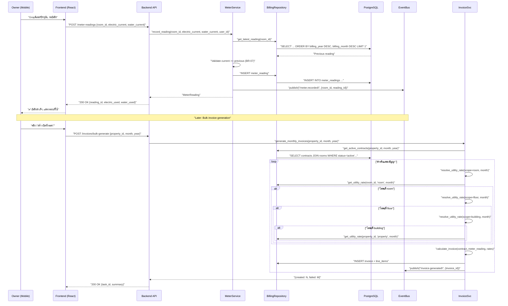
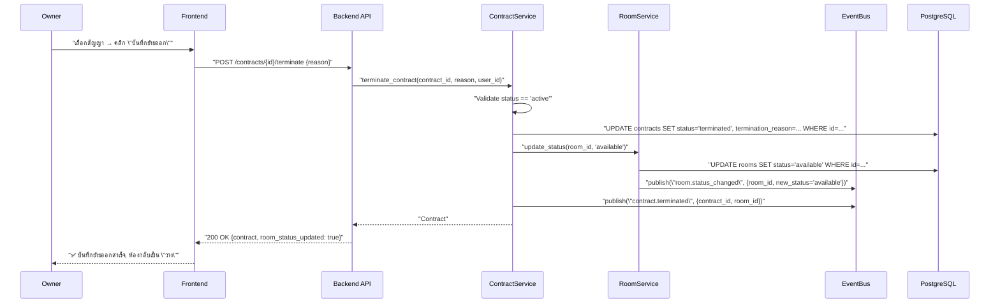

# File: 02-design/SDD/05-business-rules.md
# Critical Sequence Diagrams + State Machines + Business Rules
## Property Management System

---

## 5. Critical Sequence Diagrams

### 5.1 Meter Reading → Invoice Generation Flow


### 5.2 Contract Termination → Room Status Update


---

## 6. State Machines

### 6.1 Invoice Status Machine
```text
draft ──[send]──▶ sent ──[pay]──▶ paid
                  │                │
                  ├─[overdue]──▶ overdue
                  │                │
                  └─[cancel]──▶ cancelled (immutable)

Rules:
- draft → sent: Only if total_amount > 0 (FR-METER-10)
- sent → paid: When paid_amount >= total_amount (BR-05)
- sent → overdue: When current_date > due_date AND paid_amount < total_amount
- Any state → cancelled: Only by Owner, requires audit log
- cancelled, paid: Immutable — no further transitions
```

### 6.2 Contract Status Machine
```text
active ──[terminate]──▶ terminated ──[renew]──▶ active (new record)
        │
        └─[expire]──▶ expired (auto via scheduler)

Rules:
- active → terminated: Requires reason, triggers Room.status → available (BR-01)
- active → expired: Auto via daily scheduler when end_date < today
- terminated → active: Via renew_contract() — creates NEW contract record, does not modify old
- expired: Immutable
```

### 6.3 Room Status Machine
```text
available ──[contract.created]──▶ occupied ──[contract.terminated]──▶ available
              │                          │
              └─[maintenance.requested]─▶ maintenance ──[resolved]──▶ available

Rules:
- available → occupied: Only via ContractService.create_contract() (BR-01)
- occupied → available: Only via ContractService.terminate_contract() or scheduler for expired
- Any → maintenance: Via MaintenanceRequest creation
- maintenance → available: Only via MaintenanceRequest resolved
```

---

## Business Rules Enforcement Points (จาก Module Specs)

### BR-01: หนึ่งห้องต่อหนึ่งสัญญา active
- **จุดบังคับใช้:** `ContractService.create_contract()` → `ContractRepo.has_active_contract(room_id)`
- **ข้อผิดพลาด:** `CONT-001` → HTTP 409
- **Index:** Partial unique `WHERE status='active'`

### BR-02: เงินประกันขั้นต่ำ
- **จุดบังคับใช้:** `ContractService.create_contract()` → `deposit_amount >= monthly_rent * property.min_deposit_months`
- **ข้อผิดพลาด:** `CONT-002` → HTTP 400

### BR-07: ค่ามิเตอร์ปัจจุบันต้องไม่น้อยกว่าก่อนหน้า
- **จุดบังคับใช้:** `MeterService.record_reading()` → validate `current >= previous`
- **ข้อผิดพลาด:** `BILL-001` → HTTP 400
- **Test:** `test_current_must_be_gte_previous`

### BR-08: การคำนวณค่าเช่าและสาธารณูปโภค
- **จุดบังคับใช้:** `InvoiceService.calculate_invoice()` → line items calculation logic
- **FR:** FR-METER-06

### BR-10: Utility rate cascade 4 ระดับ Room → Floor → Building → Property
- **จุดบังคับใช้:** `InvoiceService.resolve_utility_rate()` → recursive fallback
- **ข้อผิดพลาด:** `BILL-003` → HTTP 500 (ถ้าไม่พบที่ Property)
- **Index:** Composite `(scope_type, scope_id, effective_from DESC)`

### BR-11: Room number ไม่ซ้ำในอาคาร
- **จุดบังคับใช้:** `RoomService.create_room()` → `RoomRepo.room_number_exists()`
- **ข้อผิดพลาด:** `PROP-001` → HTTP 409
- **Index:** Unique `(building_id, room_number)`

### BR-12: Floor ID บังคับถ้าอาคารมีชั้น
- **จุดบังคับใช้:** `RoomService.create_room()` → `BuildingRepo.building_has_floors()`
- **ข้อผิดพลาด:** `PROP-002` → HTTP 400