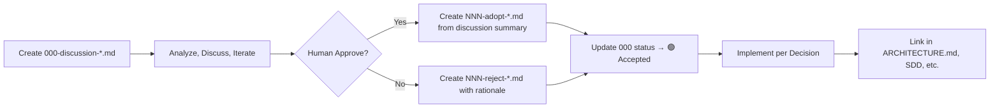

# Decisions Index — Property Management System

Directory นี้เก็บ **Architecture Decision Records (ADR)** และ **Discussion Documents** ของโปรเจกต์

---

## Naming Convention

| Prefix | Type | Description | Mutability |
|--------|------|-------------|------------|
| `000-discussion-<topic>.md` | Discussion | Analysis, pros/cons, questions (pre-decision) | 🔄 Living document |
| `NNN-adopt-<topic>.md` | Decision (ADR) | Accepted decisions — immutable after approval | ✅ Frozen |
| `NNN-reject-<topic>.md` | Decision (ADR) | Rejected decisions with rationale | ✅ Frozen |
| `NNN-supersede-<topic>.md` | Decision (ADR) | Replaces previous decision | ✅ Frozen |

- `NNN` = ลำดับที่ 3 หลัก (001, 002, 003...)
- `<topic>` = kebab-case short summary

---

## Status Badges

| Badge | Meaning |
|-------|---------|
| 🟡 **Discussion** | Under analysis, not yet decided |
| ✅ **Accepted** | Approved, implemented or implementing |
| ❌ **Rejected** | Not adopted, reasons documented |
| 🔄 **Superseded** | Replaced by newer decision (see `Supersedes:` field) |
| 📦 **Archived** | Moved to `archive/`, no longer relevant |

---

## Decision List

| ID | Title | Status | Date | Link |
|----|-------|--------|------|------|
| 000 | Adopt Hermes Multi-Agent Profiles + Kanban Board for PMS Fullstack Integration Testing & Hardening | 🟢 Accepted | 2026-07-05 | [000-discussion-hermes-multi-agent.md](000-discussion-hermes-multi-agent.md) |
| 001 | Adopt Hermes Single E2E Profile (pms-e2e) for Phase 1 E2E Campaign | ✅ Accepted | 2026-07-05 | [001-adopt-hermes-single-e2e-profile.md](001-adopt-hermes-single-e2e-profile.md) |
| 005 | Adopt Orchestrator Evaluation Checklist as Mandatory Standard | ✅ Accepted | 2026-07-24 | [005-adopt-orchestrator-evaluation-checklist.md](005-adopt-orchestrator-evaluation-checklist.md) |

> เพิ่ม row ใหม่ทุกครั้งที่สร้าง discussion หรือ decision ใหม่

---

## Cross-Reference Rules

1. **Discussion → Decision**: Discussion file ต้องมี link ไป Decision file ที่เกี่ยวข้อง
   ```markdown
   **Related Decision:** [`001-adopt-...`](001-adopt-hermes-multi-agent-profiles.md) (to be created)
   ```

2. **Decision → Discussion**: Decision file ต้องมี link กลับไป Discussion file
   ```markdown
   **Discussion:** [`000-discussion-...`](000-discussion-hermes-multi-agent.md)
   ```

3. **Superseded**: Decision ใหม่ที่แทนที่เก่า ต้องระบุ
   ```markdown
   **Supersedes:** `001-adopt-...`
   ```

---

## Workflow



### Steps

1. **New Topic** → สร้าง `000-discussion-<topic>.md` จาก template
2. **Analyze** → บันทึก context, options, pros/cons, questions
3. **Review** → Human review, comment, iterate
4. **Decide** →
   - **Approve** → สร้าง `NNN-adopt-<topic>.md` จาก decision template
   - **Reject** → สร้าง `NNN-reject-<topic>.md` พร้อมเหตุผล
5. **Update** → Discussion status, Decision status, Index table
6. **Propagate** → อัปเดต cross-references ใน `ARCHITECTURE.md`, `backend/docs/02-design/SDD/`, `backend/docs/OPERATIONS.md`

---

## Templates

- [Discussion Template](templates/discussion-template.md) — สำหรับ `000-discussion-*.md`
- [Decision Template (ADR)](templates/decision-template.md) — สำหรับ `NNN-adopt/reject/supersede-*.md`

---

## Archive

Decision/discussion ที่เก่า ล้าสมัย หรือถูก supersede ให้ย้ายไป `archive/`:

```bash
mv 000-discussion-old-topic.md archive/
mv 001-reject-old-topic.md archive/
```

File ใน `archive/` ไม่ต้องแสดงใน Index table นี้

---

## Related Directories

| Directory | Purpose |
|-----------|---------|
| `docs/AI_AGENT_WORKFLOW/` | HOW-TO guides (implementation details) |
| `docs/ARCHITECTURE.md` | System architecture, ADRs referenced here |
| `backend/docs/02-design/SDD/09-deployment.md` | Deployment decisions |
| `backend/docs/OPERATIONS.md` | Operational runbooks |