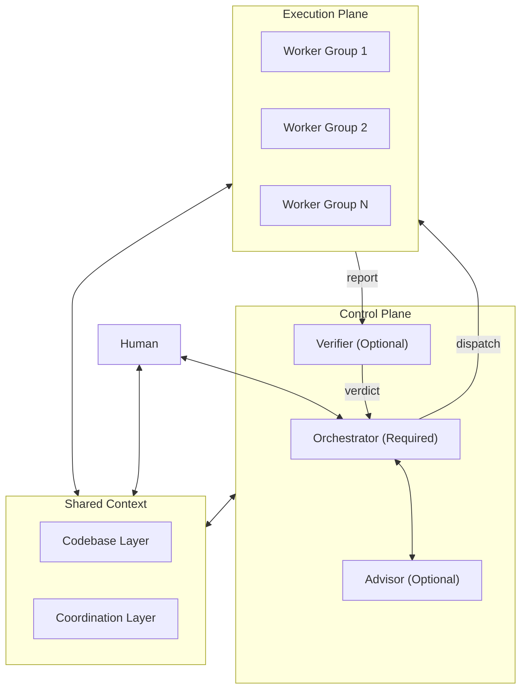

# Software Development With Multi AI Agent Tools Architecture

**Status:** Reusable architectural idea (not project-specific)
**Scope:** This document describes a *pattern*, not an implementation. It contains no references to any specific codebase, tool vendor, or team — every project (including this one) fills in §6 with its own instance.

This document presents an architectural idea that allows different AI agent tools — Claude Code, Codex, GitHub Copilot, Antigravity, Kiro, Hermes Agent, Openclaw, or any other — to collaborate on the same project and shared context, with a continuous workflow and no lock-in to any specific vendor. The goal is to give the project owner full freedom to choose whichever tools minimize cost while maximizing productivity, without compromising the quality control needed to ship production-grade software.

---

## 1. Core Principles

Every section below exists to satisfy these principles. If a later section ever conflicts with one of these, the principle wins — fix the section, not the rule.

1. **State outlives tools.** No entity may rely on its own memory to continue work — it must read from Shared Context (§4) before starting any task, with no exceptions. This is the single rule that makes tool-swapping possible at all.
2. **Roles, not vendors.** Every entity in §2 is defined by function, not by which tool fills it. Any tool capable of reading Shared Context and honoring the Task Contract (§5) can occupy any role.
3. **Code beats documentation.** When a spec/SRS/README disagrees with the actual codebase, the codebase wins. Stale docs happen in every project — no entity may trust a doc without checking it against real code first.
4. **Generation and verification are separate concerns.** A Worker's own report of success is not evidence. Mechanical checks (tests, typecheck, lint) must pass as scripted fact; judgment-based checks should come from an entity that did not produce the work being checked (§2.2.1).
5. **Escalation has a fixed boundary.** The Orchestrator decides autonomously within scope. Anything security-relevant, destructive, or that changes agreed scope goes to the Human — never silently absorbed into "just proceed."

---

## 2. Roles & Responsibilities

Every role below is a role, not a vendor — any tool can take on any role, as long as it reads/writes Shared Context according to the contract defined in §4-5.

### 2.1 Human

Makes the final call on anything the Orchestrator escalates (scope changes, security-relevant changes, permanent data destruction). Does not execute work directly.

The Human can also read Shared Context directly — they don't have to go through the Orchestrator as the only channel. For example, opening a task-tracking file or the Coordination Layer to check status/make a decision without waiting for the Orchestrator to summarize it.

### 2.2 Control Plane

| Role | Required/Optional | Responsibility |
|------|------|--------|
| **Orchestrator** | Required | Translates decisions into self-contained tasks for Workers (§5), tracks state in the Coordination Layer, makes the final call (accept/reject/escalate/route to the next SDLC loop) informed by the Verifier's output if one exists — retains override authority even when the Verifier reports a pass |
| **Advisor** | Optional | Gives architectural/security opinions to inform the Orchestrator's or Human's decisions — pure reasoning, does not touch the repo or execute anything itself. Can be the same tool as the Orchestrator (a different "hat") or a separate tool entirely |
| **Verifier** | Optional (recommended when running several parallel Workers, or when a Worker runs on a lower-reliability model) | Checks a Worker's output against ground truth before handing it to the Orchestrator for a decision (see §2.2.1) |

Orchestrator/Advisor/Verifier don't have to be the same tool over time — a project might use Tool A as Orchestrator today and switch to Tool B tomorrow, as long as the new tool reads Shared Context before starting work per §1.

#### 2.2.1 Verification — separating mechanical from judgment-based checks

**Mechanical/objective verification doesn't need an agent at all** — "does typecheck pass," "do tests pass," "does the diff match what was asked" can be checked with a script directly. This maps to whatever VALIDATION/exit-criteria loop your SDLC process defines — exit criteria should be a command a script can run, not a human/agent opinion.

**Judgment-based verification** ("is this actually the right fix," "is there a security implication the tests don't cover," "did the Worker quietly expand scope") should have a **Verifier as a separate role in the Control Plane**, not folded entirely into the Orchestrator's job. Reasons:

- **Reduces bias** — the Orchestrator wrote the prompt/gave the instructions itself, and tends to have confirmation bias that what it asked for was done correctly ("grading your own homework"). A separate Verifier has no stake in that outcome.
- **Cost/scale** — a Verifier's job is narrower than a Worker's (only checking, not generating), so it can run on a cheaper tool/model, and it keeps the Orchestrator from becoming a bottleneck when several Workers run in parallel.

**Mandatory rules when a Verifier exists:**
- The Verifier **must not be the same instance/tool as the Worker being checked** — this prevents blind spots from repeating.
- The Verifier only **reports findings**, it doesn't decide on the Orchestrator's behalf — the Orchestrator can still reject/escalate even when the Verifier reports a pass.
- Verification rigor should scale with how reliable the Worker's tool/model is — a Worker running a free-tier/small model has a higher hallucination risk and needs stricter verification.

**If there's no Verifier** (e.g., work too small to justify an extra entity) — the Orchestrator takes on judgment-based verification itself, but should be aware it's absorbing the bias risk described above.

### 2.3 Execution Plane

Workers have no memory across tasks — every task must be a self-contained prompt that can be read and acted on without asking follow-up questions (see the template in §5). This is a role any tool can fill — a Worker can be any capable tool at all, as long as it follows the contract in §5.

Start with however many worker groups the work naturally splits into (e.g., by layer, by domain, by service) — each group can have more than one Worker, and they can run in parallel. This is decided jointly by the Human and Orchestrator based on the work at hand.

**A note on scaling:** as a codebase grows, a single worker group covering an entire layer (e.g., "Backend") can become too coarse — different subsystems can have very different transaction/session semantics from each other. Start with fewer, broader worker groups, but as the project grows, consider splitting into narrower per-subsystem workers rather than continuing to force-fit new work into an outdated grouping.

---

## 3. What makes this vendor-agnostic

No entity is tied to a specific vendor, because:

1. **The task contract is plain text** (§5) — it uses no tool-specific features. Any capable agent tool, present or future, can read it and act on it the same way.
2. **State lives outside every tool's context window** (§4) — switching tools means reading the same files and continuing immediately, with no one needing to "explain the handover."
3. **A Worker is bound to a "profile/config," not a "vendor"** — one profile is one model+provider combination that can be swapped freely. A project might run a free-tier model for routine work and a stronger model for hardening tasks — same mechanism, different providers.

---

## 4. Shared Context

Split into two layers by kind of data — separated because "the truth of the system" (Codebase) and "metadata on who is doing what and how far along" (Coordination) have different lifecycles (code is committed once and stays; task state changes every few minutes).

### 4.1 Codebase Layer

The ground truth of the real system — the git repo itself. Break it down however the project's actual architecture is organized (by service, by app, by package, etc.).

Every Worker/Orchestrator must **read the real code first** before trusting that a spec/SRS/doc is accurate — stale docs that no longer match the implementation are a recurring failure mode in every project. When a doc and the code disagree, the code wins.

### 4.2 Coordination Layer

Whatever mechanism the project already has for tracking task state — don't invent a new one that duplicates it. Typically some combination of:

| Level | Example mechanism | Purpose |
|---|---|---|
| Initiative/feature lifecycle | A proposal/RFC file per initiative, with a defined set of lifecycle states (e.g., active/completed/future) | The entry point for any unit of work — every task should trace back to one of these |
| Fine-grained task tracking | A checklist or table (e.g., `Task ID \| Description \| Status \| Evidence`) scoped to one initiative | The BUILD/VALIDATION checklist inside a single initiative |
| Decision/bug log | A running log of *why* something was fixed a particular way | Prevents re-fixing the same bug the same wrong way twice |
| Mechanical task queue | A durable, atomic-claim work queue (kanban board, ticket system, or equivalent) that survives across sessions/tools | Real multi-agent dispatch — parallel worker graphs, claim/lock semantics |
| Root pointer | A single well-known file every entity reads first (e.g., `AGENTS.md`, `CONTRIBUTING.md`) | The one entry point every entity — regardless of which tool it is — must read before starting work |

---

## 5. Task Contract (the prompt format sent to a Worker)

Every task handed to a Worker must include all 4 of these sections (a Worker has no memory across sessions and doesn't know which tool created the task):

1. **Role** — who the Worker is for this task, its scope of authority to decide on its own vs. what must be escalated back, grounded in the project's real conventions (contributing guide, process doc, relevant tracking file).
2. **Responsibility** — the mandatory process to follow before/during the work (audit before changing anything, no faking/mocking what should be real, verify before declaring done, the format for reporting back).
3. **Task** — a clearly scoped deliverable, plus the verification command(s) that must actually be run.
4. **User Requirements** — what the Human/Advisor actually wants this round — the Orchestrator must not guess and fill this in on their behalf.

---

## 6. Mapping to real tools — fill in per project

This section is intentionally left as a template. It should be filled in and kept current for whichever project adopts this architecture, and updated whenever tools are swapped — the rest of this document should never need to change as a result.

| Concept | Instance in *this* project (fill in) |
|---|---|
| Control Plane — Orchestrator | *(tool name)* |
| Control Plane — Advisor | *(tool name, or "same as Orchestrator, different hat")* |
| Control Plane — Verifier | *(tool name, or "not yet set up")* |
| Execution Plane | *(tool(s) + how many worker groups/profiles)* |
| Coordination Layer (mechanical) | *(kanban board / ticket system / equivalent, and where it lives)* |
| Coordination Layer (document) | *(path to the tracking docs described in §4.2)* |
| Codebase Layer | *(this repo, or the specific set of repos)* |

**Note:** if your tool's built-in orchestration features (e.g., a "swarm" or "worker/verifier/synthesizer" mode) already cover the Execution Plane + Verifier roles from §2.2.1, prefer using what already exists rather than hand-rolling a parallel system — but see §8 for the risk of depending on it too heavily.

---

## 7. Open work (left visible, not hidden)

Keep an honest running list here of what this project hasn't done yet to fully realize this architecture — e.g., no Verifier role set up yet, no dedicated task queue/board for this project yet, no formal initiative/proposal filed for adopting this pattern yet, cross-tool interoperability (beyond the tools currently in use) not yet proven.

---

## 8. Known Risks

- **The mechanical Coordination Layer tool can become a soft vendor lock-in.** If it's a proprietary board/queue that only one CLI knows how to read/write, it only works cleanly when every Executor is that same tool's profile. The moment a different agent tool joins as an Executor — if it can't install or speak that tool's CLI — it can't participate in coordination at all, which violates Core Principle 2 ("Roles, not vendors").
  - **Mitigation:** treat git-tracked files (the task tracking table + decision log from §4.2) as the durable source of truth, and treat any proprietary kanban/queue tool as an accelerator/mirror only for as long as every Executor happens to be that tool's profile — never the other way around.
