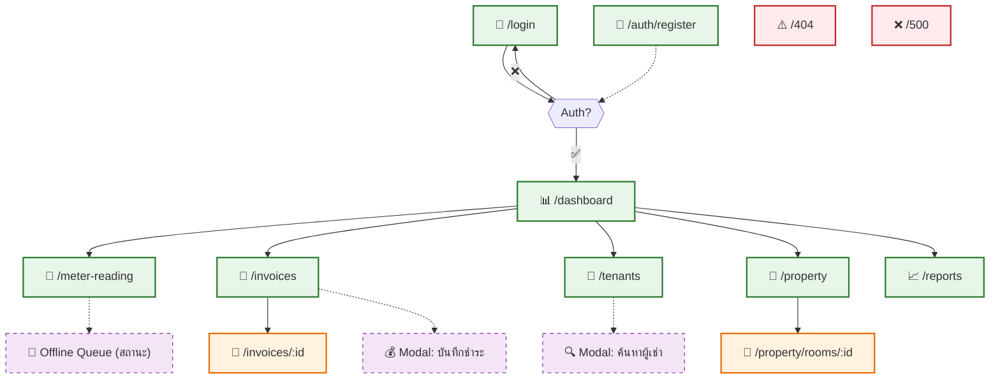
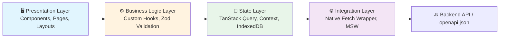

# File: frontend/docs/02-design/SDD/01-architecture.md
# Information Architecture + Frontend Architecture & Layering
## Property Management System (Client-Side)

---

## 2. Information Architecture & Navigation Flow

### 2.1 Site Map (Tree Structure — Complete Routes)


### 2.2 Navigation & Routing Strategy (ครบทุกหน้า)
| Route Pattern | Component | Lazy Load? | Auth Required? | Data Prefetch | Notes |
|--------------|-----------|------------|----------------|---------------|-------|
| `/login` | `LoginPage` | ❌ No | ❌ No | — | Initial load, no skeleton |
| `/auth/register` | `RegisterPage` | ❌ No | ❌ No | — | Invite flow entry point |
| `/` | `AuthGuard` | ✅ Yes | ✅ Yes | — | Redirect to `/dashboard` if auth |
| `/dashboard` | `DashboardPage` | ✅ Yes | ✅ Yes | `prefetch: true` | Aggregation widgets |
| `/meter-reading` | `MeterReadingPage` | ✅ Yes | ✅ Yes | `prefetch: false` | PWA Offline support |
| `/invoices` | `InvoiceListPage` | ✅ Yes | ✅ Yes | `prefetch: true` | Table + filters + bulk actions |
| `/invoices/:id` | `InvoiceDetailPage` | ✅ Yes | ✅ Yes | `prefetch: false` | Sub-route, payment history |
| `/tenants` | `TenantListPage` | ✅ Yes | ✅ Yes | `prefetch: false` | Search + CRUD + ID card upload |
| `/property` | `PropertyListPage` | ✅ Yes | ✅ Yes | `prefetch: false` | List properties, add/edit |
| `/property/rooms/:id` | `RoomDetailPage` | ✅ Yes | ✅ Yes | `prefetch: false` | Room info, contract, meter history |
| `/reports` | `ReportsPage` | ✅ Yes | ✅ Yes | `prefetch: false` | Charts + export to CSV/PDF |
| `*` (404) | `NotFoundPage` | ❌ No | ❌ No | — | System fallback |
| `/error` (500) | `ErrorFallbackPage` | ❌ No | ❌ No | — | Error boundary fallback |

> ✅ **กฎ:** 
> - ใช้ `React.lazy()` + `Suspense` ทุก route ย่อย (ยกเว้น `/login`, `/register`, system pages)
> - แสดง Skeleton loading ระหว่าง fetch สำหรับหน้าหลัก
> - เก็บ state การ scroll/filter ใน URL params (`?page=2&search=...`)
> - Sub-routes (`:id`) ใช้ `useParams()` + `useQuery` with `enabled: !!id`

---

## 4. Frontend Architecture & Layering

### 4.1 Layered Responsibility (Strict)


| Layer | หน้าที่ | ห้ามทำ |
|-------|--------|--------|
| **Presentation** | Render UI, handle user events, pass props | ❌ เรียก API โดยตรง, ❌ จัดการ global state |
| **Hooks** | Wrap query/mutation, form validation, transform data | ❌ เก็บ state ยาวนาน, ❌ ใช้ side-effect นอก React lifecycle |
| **State** | Cache server data, manage auth session, queue offline | ❌ mutate cache โดยไม่ผ่าน query client, ❌ บล็อก main thread |
| **Integration** | `fetch` wrapper, header injection, 401 retry, error mapping | ❌ มี business logic, ❌ hardcode error messages |

### 4.2 Feature-Sliced Directory Structure
```text
src/
├── features/
│   ├── auth/        # LoginPage, RegisterPage, useAuth
│   ├── dashboard/   # DashboardPage, StatsCards, OverdueTable
│   ├── billing/     # MeterReadingPage, InvoiceListPage, offlineQueue
│   ├── tenant/      # TenantListPage, SearchModal
│   ├── property/    # PropertyListPage, RoomDetailPage
│   └── reports/     # ReportsPage, ExportUtils
├── shared/
│   ├── api/         # fetchClient.ts, errorMapper.ts, queryClient.ts
│   ├── ui/          # Button, Input, Modal, Table, Skeleton
│   ├── hooks/       # useAuth, useOfflineSync, useDebounce
│   ├── utils/       # formatters.ts, validators.ts, linePreview.ts
│   └── pwa/         # service-worker.ts, idb.ts, sync.ts
├── routes/          # index.tsx, ProtectedRoute.tsx, lazy components
├── layouts/         # MainLayout, AuthLayout, ErrorBoundary
├── types/           # api.d.ts (auto-generated)
└── main.tsx         # App entry, providers, router setup
```

### 4.3 Module Internal Structure Guidelines (Progressive Nesting)

เพื่อให้โครงสร้างไฟล์ภายใน `features/` สะอาดและ Scale ได้ โดยไม่ Over-engineering ตั้งแต่แรก ให้ใช้หลักการ **Progressive Nesting**

#### Default: Flat Structure (สำหรับโมดูลที่มี ≤8 ไฟล์)
```text
src/features/<module>/
├── <Page>Page.tsx           # ✅ Page components อยู่ระดับบนสุดเสมอ (เพื่อ React.lazy)
├── use<Feature>Query.ts     # Hooks อยู่ระดับบนสุดถ้ามี ≤3 ตัว
├── use<Feature>Mutation.ts
└── <utility>.ts             # Utils อยู่ระดับบนสุดถ้ามี ≤2 ตัว
```

#### เมื่อไหร่ควรเริ่มแบ่งโฟลเดอร์ (Trigger Conditions)
- ✅ โมดูลมีไฟล์รวม **>8 ไฟล์**
- ✅ มี custom hooks **>3 ตัว** → สร้าง `hooks/`
- ✅ มี reusable components **>3 ตัว** → สร้าง `components/`
- ✅ มี utilities **>2 ตัว** → สร้าง `utils/`
- ✅ มี module-specific types นอกเหนือจาก `api.d.ts` → สร้าง `types/`

#### กฎการแบ่งชั้น (Nesting Rules)
1. **Pages อยู่ระดับบนสุดเสมอ**: `*Page.tsx` ต้องอยู่ที่ `features/<module>/` เสมอ เพื่อให้ `React.lazy()` import ง่าย
2. **ใช้ `index.ts` เป็น Facade**: เมื่อเริ่มแบ่งโฟลเดอร์ ให้สร้าง `index.ts` เพื่อรวม export → ลดการ import ลึก
   ```typescript
   // features/billing/index.ts
   export { MeterReadingPage } from './MeterReadingPage';
   export { useRecordMeterMutation } from './hooks/useRecordMeterMutation';
   export { OfflineBanner } from './components/OfflineBanner';
   ```
3. **ห้ามซ้อนเกิน 2 ระดับ**: `features/billing/hooks/` ✅ / `features/billing/hooks/meter/` ❌ (ยกเว้นจำเป็นจริง)
4. **โครงสร้างทดสอบต้องสะท้อนแหล่งที่มา**: `tests/features/<module>/` ต้องมีโครงสร้างเหมือน `src/features/<module>/`
5. **Utils ต้องเป็นโมดูลเฉพาะ**: ไฟล์ใน `utils/` ต้องใช้เฉพาะในโมดูลนั้นเท่านั้น — ถ้าใช้ข้ามโมดูลให้ย้ายไป `shared/utils/`

#### ตัวอย่าง: Billing Module (Flat → Nested Transition)
```text
# MVP (Flat, ~5 files)
src/features/billing/
├── MeterReadingPage.tsx
├── InvoiceListPage.tsx
├── useRecordMeterMutation.ts
├── useInvoicesQuery.ts
└── offlineQueue.ts

# Growth (Nested, ~15 files)
src/features/billing/
├── index.ts                 # Facade exports
├── MeterReadingPage.tsx     # Pages still at root
├── InvoiceListPage.tsx      # Pages still at root
├── hooks/                   # Separated when >3 hooks
│   ├── useRecordMeterMutation.ts
│   ├── useInvoicesQuery.ts
│   └── usePaymentMutation.ts
├── components/              # Separated when >3 UI parts
│   ├── MeterInput.tsx
│   ├── InvoiceTable.tsx
│   └── PaymentModal.tsx
├── utils/                   # Separated when >2 utils
│   ├── offlineQueue.ts
│   └── invoiceFormatters.ts
└── types/                   # Module-specific types
    └── billing.ts
```

> ✅ **Benefit**: เริ่มพัฒนาเร็วในเฟส 1, มีเส้นทางชัดเจนเมื่อโมดูลขยาย, รักษาความเรียบง่ายแต่ไม่เสียความสามารถในการขยาย
> 🔄 **Change Control**: เมื่อเปลี่ยนโครงสร้าง → อัปเดต `index.ts` facade + `routes/index.tsx` lazy imports + ย้าย test files ให้สอดคล้อง