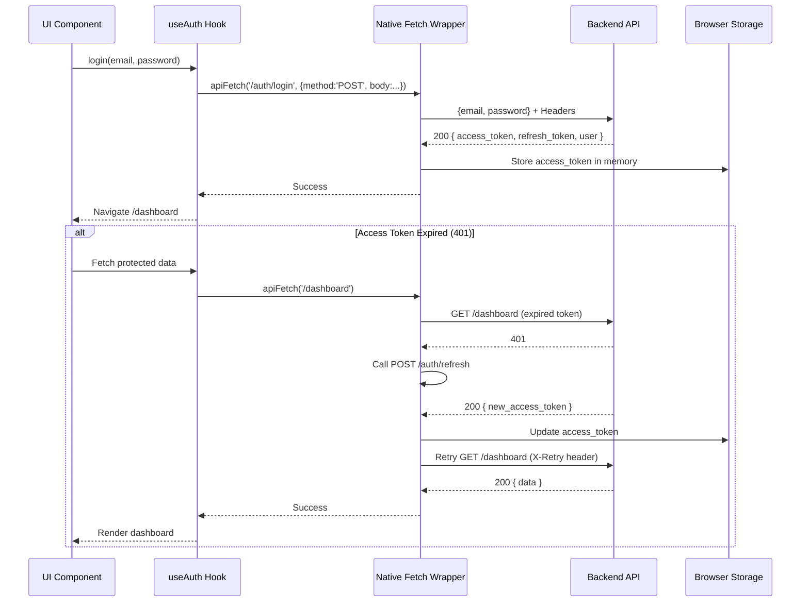
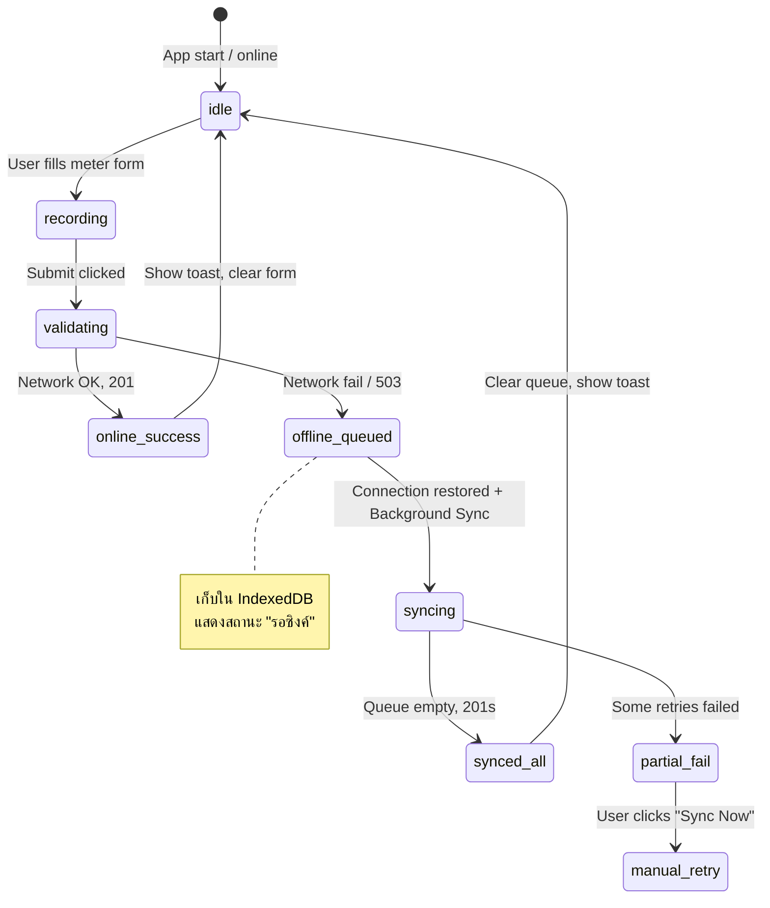

# File: frontend/docs/02-design/SDD/05-diagrams.md
# UML/Design Diagrams (Client-Side)
## Property Management System (Client-Side)

---

## 7. UML/Design Diagrams (Client-Side)

### 7.1 Sequence Diagram: Auth Flow + Token Refresh (Native Fetch)

### 7.2 State Machine: Offline Sync Lifecycle
